《计算机网络》第二章：物理层（The Physical Layer）

* Copyright(C)肖文栋教授@北京科技大学自动化学院
# 内容安排
* 物理层基本介绍
* 数据通信的理论分析
* 导向传输媒体
* 无线传输
* 通信卫星
* 数字调制
* 信道复用技术
* 公共电话交换系统
* 移动电话系统

# 一.物理层基本介绍

## 1.物理层在原理模型中的位置
* 物理层是原理模型/OSI参考模型的最低层，向下直接与物理传输介质相连接。
* 物理层不是指与计算机相连接的具体的物理设备或具体的传输介质；
* 主要考虑的是如何在传输介质上传输各种数据的比特流。

## 2.物理层与物理传输介质的关系
* 计算机网络中可以利用的物理传输介质与传输设备种类繁多，各种通信技术存在着很大差异，而且各种新的通信技术快速发展。
* 网络设计中，试图通过设置物理层，来尽可能的屏蔽这些差异，使数据链路层只须考虑本层的服务与协议，而不需考虑具体使用了哪些物理传输设备或传输介质；
* 实现两个网络设备之间在物理信道上进行二进制比特流的透明传输，对上层屏蔽物理传输介质的差异。

数据通信系统的模型

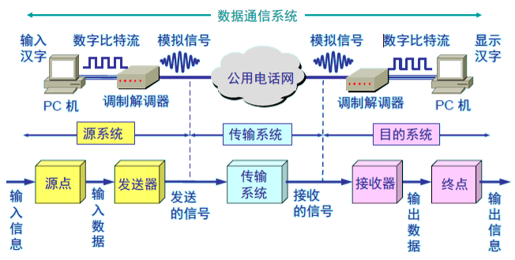

## 3.物理层的任务
物理层的主要任务描述为确定终端设备与传输媒体的接口的一些特性，即：
机械特性指明接口所用接线器的形状和尺寸、引线数目和排列、固定和锁定装置等等。
电气特性指明在接口电缆的各条线上出现的电压的范围。
功能特性指明某条线上出现的某一电平的电压表示何种意义。
过程特性指明对于不同功能的各种可能事件的出现顺序。

## 4.物理层的标准
物理层关心的并不是具体终端设备或物理传输介质，而是关心终端设备（DTE）通过连接设备（DCE）介入通信网的描述和规定（即通信接口）。
电子工业协会（EIA）和国际电信联盟电信标准化部（ITU-T）参与制定了DTE-DCE通信接口的标准。EIA制订的标准称为EIA-232，EIA-442，EIA-449等。

物理层标准RS-232：电子工业协会EIA制定的标准，常用做Modem接口
机械特性：D型连接器DB-9 或DB-25。目前绝大多数计算机使用的是9针的D型连接器。RS-232D规定使用25针的D型连接器。
电气特性：用低于-3V的电压代表逻辑“1”，高于+4V的电压代表逻辑“0”。在传送距离不大于15m时，最大速率为19.2kb/s。
功能特性：规定了25针各与哪些电路连接，以及每个信号的定义。比如针2用于传输数据，则针3用于接收数据等。
RS-232: 电子工业协会EIA制定的标准，常用做Modem接口。
规程特性：协议，事件的合法顺序。

* “术语”
* 数据(data)——运送消息的实体。
* 信号(signal)——数据的电气的或电磁的表现。
* “模拟的”(analogous)——代表消息的参数的取值是连续的。
* “数字的”(digital)——代表消息的参数的取值是离散的。
* 码元(code)——在使用时间域（或简称为时域）的波形表示数字信号时，代表不同离散数值的基本波形。
* 信源：通信过程中产生和发送信息的设备或计算机。
* 信宿：通信过程中接收和处理信息的设备或计算机。
* 信道(Channel)：通信过程中信源和信宿之间的通信线路，是传送信息的通道。一般用来表示向某一方向传送信息的线路，一条通信线路往往包含多个信道。
信道由相应的发送信息和接收信息的设备以及传输介质组成；

## 5.数据通信方式
* 单向通信（单工通信）——只能有一个方向的通信而没有反方向的交互。
* 双向交替通信（半双工通信）——通信的双方都可以发送信息，但不能双方同时发送(当然也就不能同时接收)。
* 双向同时通信（全双工通信）——通信的双方可以同时发送和接收信息。

# 二.数据通信的理论分析

## 1.傅立叶分析Fourier Analysis
* 周期信号都可以分解为一系列振幅、频率和相位都可度量的正弦波的组合形式；
* 对信号进行傅立叶变换得到系数an和bn，它们的平方和与相应频率处所传输的能量成正比
* 任何实际的信道都不是理想的，在传输信号时会产生各种失真以及带来多种干扰。不同傅立叶分量的衰减程度不同。

数字信号通过实际的信道

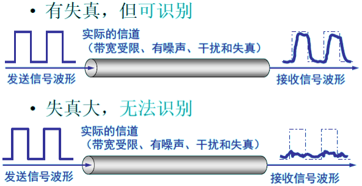

## 2.带宽有限信号Bandwidth-Limited Signals
* 信号的带宽：不论模拟信号还是数字信号，其主要成分都要占据一定的频率范围，将信号所占据的频率范围叫做信号的带宽。
* 信道的带宽：信道在信号不失真的情况下所能传送的频率范围。
一般情况下对导线而言，在0到某个频率的范围内，振幅在传输过程中不会衰减。
实际上，截止频率并没有那么尖锐。所以通常引用的信道带宽是指从0到使得能量保留一半的那个频率范围。
信道带宽是传输介质的一种物理特性。
当信道的带宽大于被传送信号的带宽时，信号才能顺利通过信道。

## 3.基带(baseband)信号和通带(passband)信号
* 基带信号（baseband, 即基本频带信号）——来自信源的信号。像计算机输出的代表各种文字或图像文件的数据信号都属于基带信号。
基带信号往往包含有较多的低频成分，甚至有直流成分，而许多信道并不能传输这种低频分量或直流分量。因此必须对基带信号进行调制(modulation)。
* 通带信号(passband)——把基带信号经过载波调制后，把信号的频率范围搬移到较高的频段以便在信道中传输（即仅在一段频率范围内能够通过信道）。到达接收端时，再把模拟信号解调成原来的数字信号.

有限带宽影响的例子：二进制信号和它的均方根傅里叶振幅

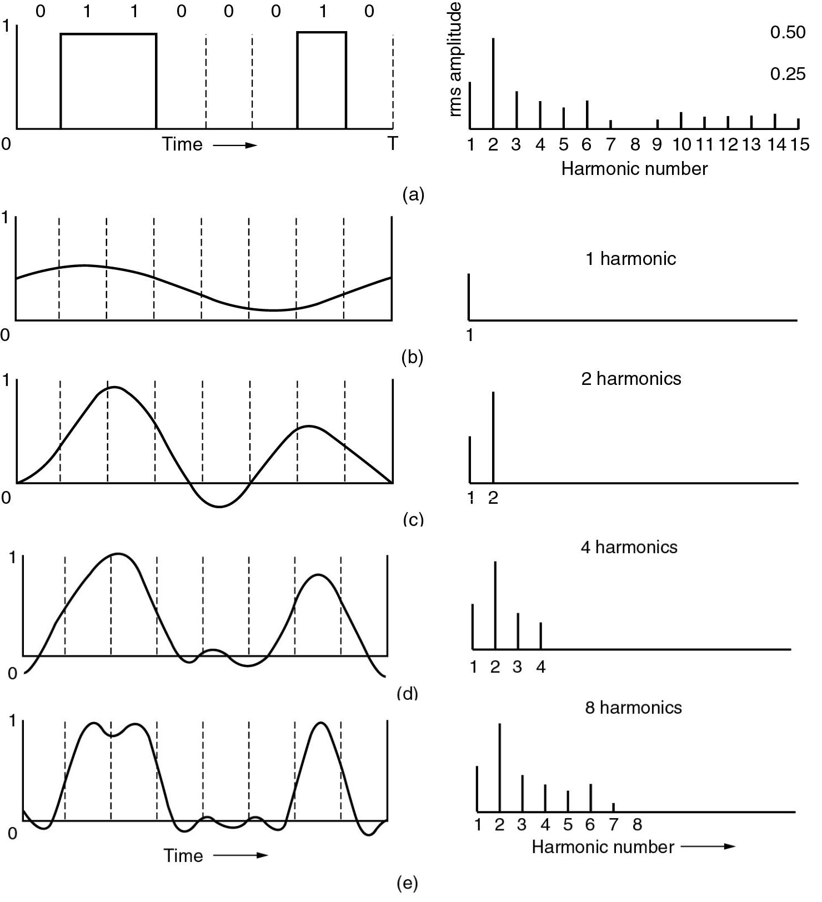

## 4.信号频谱和信号带宽
* 信号带宽：频率分量的范围；将信号频谱中最高频率减去最低频率。
* 信号频谱：指它所包含的所有频率分量的集合并且通过频域图表示；是组成该信号所有正弦波信号的组合
如：一个周期信号分解为五个频率分别为100，300，500，700和900Hz的正弦波，则带宽为800Hz。

## 5.信道能够通过的频率范围
1924 年，奈奎斯特(Nyquist)就推导出了著名的奈氏准则。他给出了在假定的理想条件下，为了避免码间串扰，码元的传输速率的上限值。
在任何信道中，码元传输的速率是有上限的，否则就会出现码间串扰的问题，使接收端对码元的判决（即识别）成为不可能。
如果信道的频带越宽，也就是能够通过的信号高频分量越多，那么就可以用更高的速率传送码元而不出现码间串扰。

## 6.信道的最大数据传输速率
1948年，香农研究了带宽受限且有随机噪声干扰的带宽为B的信道的极限数据率。
香农定理：单位：分贝（db）

表明，信道的带宽B越宽或信道的信噪比(S/N)越大，则信道的极限数据率C就越高，只要数据传输速率低于信道的极限数据率，就一定可以找到某种方法实现无差错的传输。

# 三.导向传输媒体
* 磁介质
* 双绞线
-屏蔽双绞线STP (Shielded Twisted Pair)
-无屏蔽双绞线UTP (Unshielded Twisted Pair)
* 同轴电缆
-50欧姆同轴电缆
-75欧姆同轴电缆
* 光缆

## 1.双绞线
将两根相互绝缘的导体以螺旋形相互缠绕（可使它们发射的电磁干扰相互抵消）而成的，线芯是铜线或镀铜钢线。
截面D：0.38~1.42mm。
当传输模拟信号时，最大传输距离是15KM；当传输数字信号时为1~2KM。
铺设简单，价格低廉，但保密性差，误码率高。

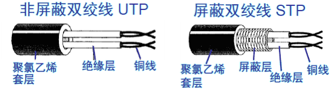

## 2.非屏蔽双绞线(UTP-unshielded twisted pair)，
* 各类双绞线有明确的规程划分，分类如下：
1、2类线——语音和低速数据线，适用于语音和最大速率为4Mbps的数字数据传输；用于电话系统布线。
3类线——数据线，适用于最大速率为10Mbps的数据传输；用于计算机网络。
4类线——数据线，数据传输速率≤ 20Mbit/s；
5类线——高速数据线，在最大数据传输速率达100Mbps的环境下使用；用于计算机网络。
超5类线——高速数据线，带宽≤1000Mbit/s；用于快速以太网，是现在市场上最常见、价廉质优的网线。
* 其中3类、5类对计算机网络很重要。
5类双绞线比3类双绞线拧的更密，交感较少并且在更长的距离上信号质量更好，更适合于高速计算机通信。

## 3.屏蔽双绞线(STP-shielded twisted pair)
在一束双绞线外包上一层金属丝网屏蔽护套制成的，屏蔽护套在使用时一定要接地。可以减少干扰和串音。价格昂贵，主要用于IBM网络装置。

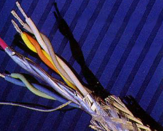

* UTP：价格低，易于安装和重新配置，技术成熟、稳定，衰减性较大，抗干扰性差，保密性
* STP：技术成熟、稳定。带宽高于UTP。较昂贵，较难于安装，衰减性较大，仍然易受干扰。

## 4.同轴电缆

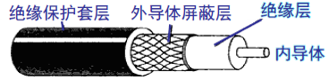

## 5.根据带宽不同分类——基带和宽带
* 基带同轴电缆
一条电缆只用于一个信道，50欧姆，用于传输基带数字信号；
8 宽带同轴电缆
可使用频分多路复用方法，支持多路传输；一条电缆同时传输不同频率的几路模拟信号；75 欧姆，用于模拟传输，300—450MHz，100km；宽带系统由于覆盖的区域广，因此需要模拟放大器周期性的加强信号。适用于：任何使用模拟信号进行传输的电缆网。

## 6.Fiber Optics 光纤
光纤是一种光传输介质，光纤是一根很细的可传导光线的纤维媒体，其半径仅几微米至一、二百微米。制造光纤的材料可以是超纯硅、合成玻璃或塑料。由于可见光频率可达108MHz，因此光纤传输系统具有足够的带宽。光缆由一束光纤组成。

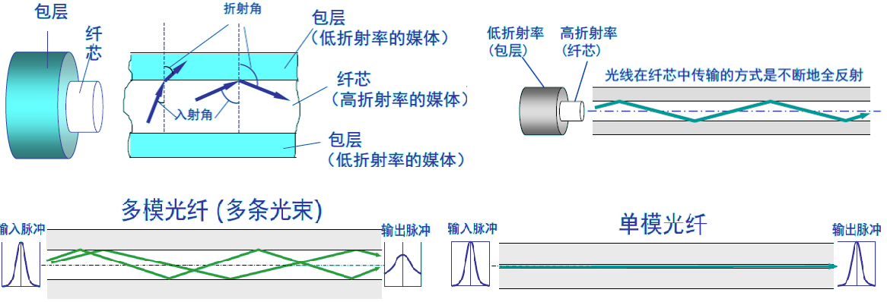

光纤传输系统的组成：光源、传输介质、检测器
用光纤传输电信号时，在发送端先要将其转换成光信号，而在接收端又要由光检测器还原成电信号。
光纤传输特点
优点：传输速率极高，频带极宽，传送信息的容量极大；抗干扰能力强；光纤不受电源干扰和静电干扰等影响，即使在同一光缆中，各光纤间几乎没有干扰，易于保密；
缺点：费用高、安装/维护较难、脆弱性。

# 四.无线传输

前述几种方式都属于“有线传输”，根据距离的远近和对通信速率的要求，可以选用不同的有线介质，但是，若通信线路要通过高山、岛屿、河流时，铺设线路就非常困难，而且成本非常高，这时候就可以考虑使用无线电波在自由空间的传播来实现多种通信。
由于信息技术的发展，在最近十几年无线电通信发展的特别快，人们不仅可以在运动中进行移动电话通信，而且还可以进行计算机数据通信，这都离不开无线信道的数据传输。

## 1.电信领域使用的电磁波的频谱

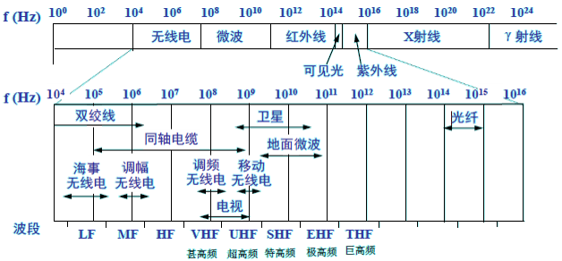

## 2.无线传输方式
无线电传输Radio Transmission
微波传输Microwave Transmission
红外传输Infrared Transmission
激光传输laserTransmission

Radio(无线电)Transmission

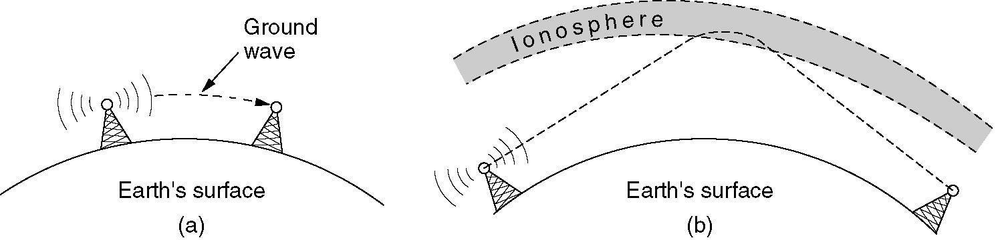

* Microwave Transmission微波传输
微波（microwave）：电磁波谱中频率在100Mhz ~10GHz的信号，对应波长为0.03~3m；
微波通信通常是利用在1GHz范围内的电波来进行通信。微波沿着直线传播。
微波不能很好地穿过建筑物，而且在空间还是会发散，存在多路减弱问题，和天气及频率有关。
信号的覆盖范围很大程度上依赖于天线的高度；天线越高，信号传播距离越远。
微波与电缆通信相比，能通过有限线路难于跨越或不易架设的地区，有较大的灵活性，抗灾能力较强；但通信隐蔽性和保密性不如电缆通信。
应用—微波通信广泛用于长途电话通信、电视传播和其他应用
优点—与光纤比较主要优点是不需要路权，相对较便宜。

* Infrared Transmission红外传输
红外（infrared）通信:利用红外线进行的通信，广泛应用于短距离的通信。
相对有方向性、便宜，容易制造。
不能穿透坚实的物体。
广泛用于短距离通信。
缺点，也是优点。一间房屋里的红外系统不会对其他房间里的系统产生干扰。

* LaserTransmission激光传输
激光（laser）的连续光信号是单向的；
提供极高的带宽；
风和温度的变化可以扭曲激光束的形状，不能穿透雨和浓雾，晴天可以工作很好。
利用激光能不通过有形的光导体直接在空中传输，并能在很长的距离内保持聚焦，即定向的特点。
应用：通过在楼顶的激光来连接两幢建筑物里的LAN。因为激光信号的单向性，每幢楼房都得有自己的激光装置。用极低的成本提供极高的带宽。

# 五.通信卫星

* Geostationary Satellites（地球同步卫星）
* Medium-Earth Orbit Satellites（中地球轨道卫星）
* Low-Earth Orbit Satellites （低地球轨道卫星）

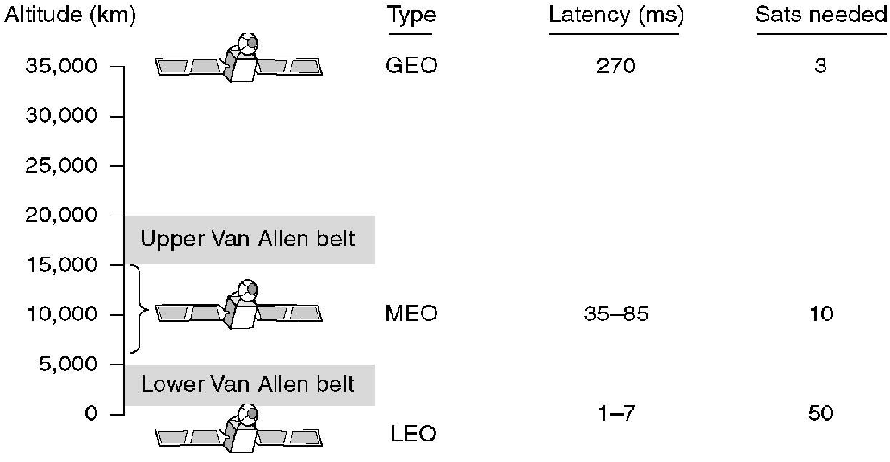

各个国家争抢焦点：轨道槽、频率
微型站VSAT：微型站VSAT使用中继的例子

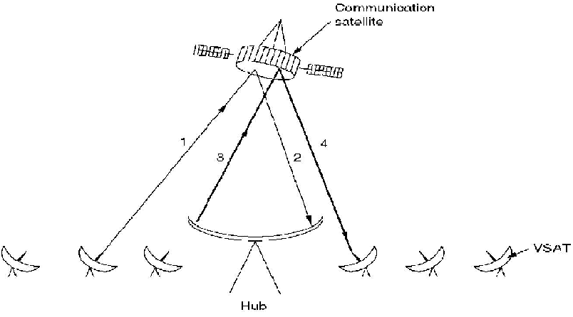

## 1.中地球轨道卫星
目前只用于导航
实例：GPS，30颗卫星
## 2.低地球轨道卫星

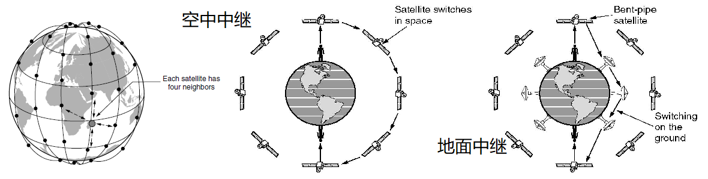

# 六.数字调制

## 1.调制与编码
在通过通信介质发送信息之前，信息必须转换成信号。而信号又必须经过处理，包含一些可识别的变化来表示预期的信息，这些变化是发送方和接收方所共知的。处理的情况：
* 数字到数字的转换：如数据在计算机中以0和1的形式存储。为了进行传输，数据通常要转换成数字信号；
* 模拟到数字的转换：如为了减少噪音，将语音信号转换成数字信号进行传输；
* 数字到模拟的转换：如利用公用电话线路传输数据，由计算机生成的数字信号应转换成模拟信号；
* 模拟到模拟的转换：模拟信号传输时，信号频率不适合于所选的介质，需要调至到适合的频率。

## 2.模拟传输和数字传输

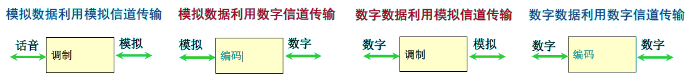

## 3.编码和调制

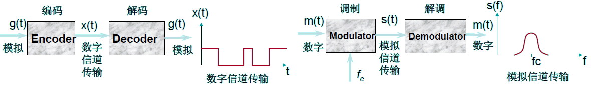

## 4.数字数据的模拟信号调制
基带传输是将信源发出的编码信号直接送入信道进行传输的方式。基带传输要求信道的频带极宽，而且波形受线路分布电容影响非常大，因此只适合近距离、内部的数据传输。
对于长距离传输，还须将数字信号转换成可在长途信道上传输的模拟信号，这就是数字信号的通带传输，又称为载波传输。
Modem 是完成数字信号与模拟信号转换、以利于在模拟信道上传输数字信号的主要设备。因此，频带传输的最主要技术就是调制与解调。

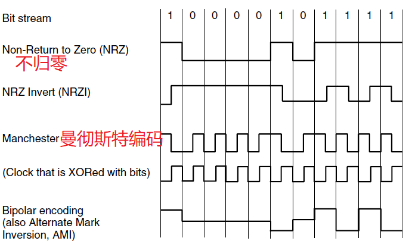

* 通带传输：正弦信号

## 5.通带传输：数字数据的模拟信号调制

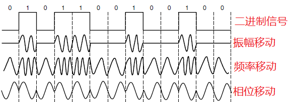

* 模拟传输中，发送设备产生一个正弦信号作为基波来承载信息信号，称为载波信号，其振幅、频率和相位被调制后，都可用来传递信息。
* 一个正弦波有三个主要特性定义：振幅、频率和相位。当我们改变其中的一个，就有了波的另一个形式。通过改变电气信号的一方面的特性，就可以用它来表示数字数据。波的三个特性中任意一个都可用这种方式改变，所以至少有三种将数字数据调至到模拟信号的机制：幅移键控法、频移键控法、相移键控法
* 此外还有：将振幅和相位变化结合起来的机制——正交调幅。

## 6.通带传输
* 幅移键控法(Amplitude-Shift Keying，ASK)用载波信号的不同幅值(A1和A2)来表示两个二进制值“0”和“1”。
* 频移键控法(Frequency-Shift Keying，FSK)用载波信号不同的频率(f1和f2)表示两个二进制值“0”和“1”。
* 相移键控法(Phase-Shift Keying, PSK)用载波信号的不同的相位(如0°和180°)来表示两个二进制值“0”和“1”, 称其为二进制相移键控(BPSK);
如采用4个偏移，如45°，135°, 225 °及315°，称其为正交相移键控(QPSK)。

星座图：振幅（与原点的距离）和相位的不同组合

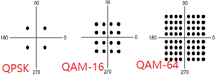

# 七.信道复用技术

## 1.频分复用、时分复用和统计时分复用
复用(multiplexing)是通信技术中的基本概念。

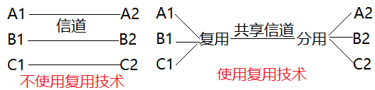

## 2.频分复用FDM(Frequency Division Multiplexing)
用户在分配到一定的频带后，在通信过程中自始至终都占用这个频带。
频分复用的所有用户在同样的时间占用不同的带宽资源（请注意，这里的“带宽”是频率带宽而不是数据的发送速率）。

## 3.时分复用TDM(Time Division Multiplexing)
时分复用则是将时间划分为一段段等长的时分复用帧（TDM 帧）。每一个时分复用的用户在每一个TDM 帧中占用固定序号的时隙。
每一个用户所占用的时隙是周期性地出现（其周期就是TDM 帧的长度）。
TDM信号也称为等时(isochronous)信号。
时分复用的所有用户是在不同的时间占用同样的频带宽度。

* 时分复用可能会造成线路资源的浪费
使用时分复用系统传送计算机数据时，由于计算机数据的突发性质，用户对分配到的子信道的利用率一般是不高的。

## 4.统计时分复用STDM(Statistic TDM)
## 5.波分复用WDM(Wavelength Division Multiplexing)
波分复用就是光的频分复用。

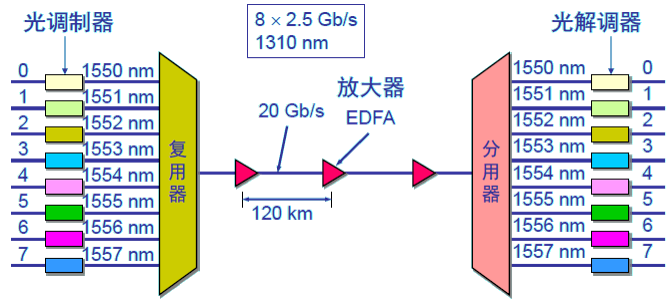

## 5.码分复用CDM(Code Division Multiplexing)
* 常用的名词是码分多址CDMA(Code Division Multiple Access)。
各用户使用经过特殊挑选的不同码型，因此彼此不会造成干扰。
这种系统发送的信号有很强的抗干扰能力，其频谱类似于白噪声，不易被敌人发现。
每一个比特时间划分为m 个短的间隔，称为码片(chip)。
* CDMA 的重要特点:
每个站分配的码片序列不仅必须各不相同，并且还必须互相正交(orthogonal)。
在实用的系统中是使用伪随机码序列。

## 6.码片序列(chip sequence)
* 每个站被指派一个唯一的mbit 码片序列。
-如发送比特1，则发送自己的mbit 码片序列。
-如发送比特0，则发送该码片序列的二进制反码。
* 例如，S 站的8 bit 码片序列是00011011。
-发送比特1 时，就发送序列00011011，
-发送比特0 时，就发送序列11100100。
S 站的码片序列：(-1 -1 -1 +1 +1 -1 +1 +1)

# 八.公共电话交换系统

## 1.电话系统
* 电话系统的结构（Structure of the Telephone System）
* 本地回路（The Local Loop）
* 主干和多路复用（Trunks and Multiplexing）
* 交换（Switching）
当相距不远的两台计算机通信时，一般是通过电缆连接到LAN来实现通信。当相距很远或有多台计算机需要通信时，常常是借助于可以满足网络通信基本要求的公用电话交换网PSTN（public switched telephone network）进行通信。
当前，PSTN与计算机网络结合得非常紧密。
Structure of the Telephone System

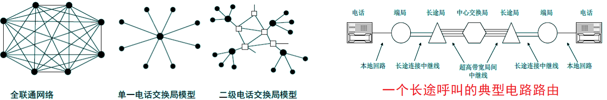

* 端局（end office）：本地中心局，每一部电话有两根铜线直接连到电话公司最近的端局；
* 本地回路（local loop）：客户电话和端局之间的双线连接；
* 长途局（toll office）：每个端局有大量的外线引至附近的一个或多个交换中心，即长途局。

## 2.数字传输的优点
* 过去，电话系统中传输的信号是模拟的，实际的话音信号被转换为电压从源端传输到目的端。随着数字电子设备和计算机的出现，话音信号可以被转换为数字信号进行传输。
* 误码率低，传输质量高；
* 可将话音、数据、文字和图像混合在一个信道传输，更有效的利用电路和设备；利用现有线路可获得更高的数据传输速率
* 数字设备可大规模集成，比模拟传输便宜，且易于维护。

## 3.本地回路：电话调制解调器
计算机-计算机呼叫中的模拟与数字传输

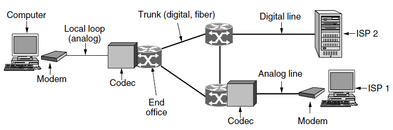

* 本地回路：宽带接入xDSL（数字用户线）技术
xDSL 技术就是用数字技术对现有的模拟电话用户线进行改造，使它能够承载宽带业务。
虽然标准模拟电话信号的频带被限制在300~3400 Hz 的范围内，但用户线本身实际可通过的信号频率仍然超过1 MHz。
xDSL 技术就把0~4 kHz 低端频谱留给传统电话使用，而把原来没有被利用的高端频谱留给用户上网使用。
* DSL 就是数字用户线(Digital Subscriber Line)的缩写。而DSL 的前缀x 则表示在数字用户线上实现的不同宽带方案。

## 4.xDSL 的几种类型
* ADSL (Asymmetric Digital Subscriber Line)：非对称数字用户线
* HDSL (High speed DSL)：高速数字用户线
* SDSL (Single-line DSL)：1 对线的数字用户线
* VDSL (Very high speed DSL)：甚高速数字用户线
* DSL ：ISDN 用户线。
* RADSL (Rate-Adaptive DSL)：速率自适应DSL，是ADSL 的一个子集，可自动调节线路速率）。

## 5.ADSL 的极限传输距离
* ADSL 的极限传输距离与数据率以及用户线的线径都有很大的关系（用户线越细，信号传输时的衰减就越大），而所能得到的最高数据传输速率与实际的用户线上的信噪比密切相关。
* 例如，0.5 毫米线径的用户线，传输速率为1.5 ~ 2.0 Mb/s 时可传送5.5 公里，但当传输速率提高到6.1 Mb/s 时，传输距离就缩短为3.7 公里。
如果把用户线的线径减小到0.4毫米，那么在6.1 Mb/s的传输速率下就只能传送2.7公里

## 6.ADSL 的特点
上行和下行带宽做成不对称的。
上行指从用户到ISP，而下行指从ISP 到用户。
* ADSL 在用户线（铜线）的两端各安装一个ADSL 调制解调器。
我国目前采用的方案是离散多音调DMT(Discrete Multi-Tone)调制技术。这里的“多音调”就是“多载波”或“多子信道”的意思。

## 7.DMT 技术
* DMT 调制技术采用频分复用的方法，把40 kHz 以上一直到1.1 MHz 的高端频谱划分为许多的子信道，其中25 个子信道用于上行信道，而249 个子信道用于下行信道。
每个子信道占据4 kHz 带宽（严格讲是4.3125 kHz），并使用不同的载波（即不同的音调）进行数字调制。这种做法相当于在一对用户线上使用许多小的调制解调器并行地传送数据。

## 8.DMT 技术的频谱分布

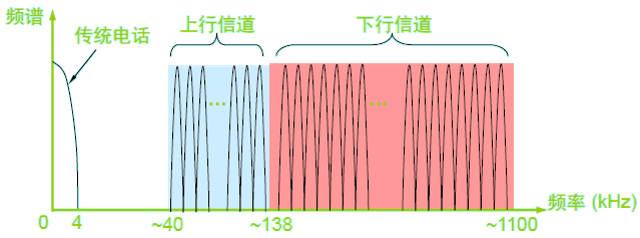

## 9.ADSL 的数据率
由于用户线的具体条件往往相差很大（距离、线径、受到相邻用户线的干扰程度等都不同），因此ADSL 采用自适应调制技术使用户线能够传送尽可能高的数据率。
当ADSL 启动时，用户线两端的ADSL 调制解调器就测试可用的频率、各子信道受到的干扰情况，以及在每一个频率上测试信号的传输质量。
ADSL 不能保证固定的数据率。对于质量很差的用户线甚至无法开通ADSL。
通常下行数据率在32 kb/s 到6.4 Mb/s 之间，而上行数据率在32 kb/s 到640 kb/s 之间。

## 10.本地回路：FTTx 技术
FTTx（光纤到……）也是一种实现宽带居民接入网的方案。这里字母x 可代表不同意思。
* 光纤到家FTTH (Fiber To The Home)：光纤一直铺设到用户家庭可能是居民接入网最后的解决方法。
* 光纤到大楼FTTB (Fiber To The Building)：光纤进入大楼后就转换为电信号，然后用电缆或双绞线分配到各用户。
* 光纤到路边FTTC (Fiber To The Curb)：从路边到各用户可使用星形结构双绞线作为传输媒体。

## 11.Trunks and Multiplexing中继线和多路复用
电话网络核心传送的是数字信息而不是模拟信息
需要在端局对语音信号进行数字化转换
采用多路复用使中继线上进行多个电话呼叫。

## 12.数字化语音信号：脉冲编码调制（PulseCodeModulation）

## 13.Trunks and Multiplexing中继线和多路复用
* 电话公司精心设计了一些方法，把多路会话复用到一条物理主干信道上。从技术实现上，可分为两类方法：
-频分多路复用(Frequency Division Multiplexing,FDM)
-时分多路复用(Time Division Multiplexing,TDM )
在计算机网络通信中也利用这些方法，用一条物理主干信道传输多路数据。

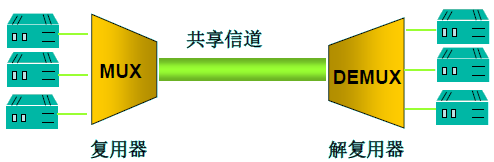

## 14.SONET/SDH
* 标准
-1985年，Bellcore提出同步光网络SONET（Synchronous Optical NETwork）标准。
-1989年，CCITT提出同步数字系列SDH（Synchronous Digital Hierarchy）标准，与SONET 有微小差别。
-SONET主要用于北美和日本，SDH主要用于欧洲和中国。
* SONET/SDH，采用TDM技术，是同步系统，由主时钟控制，时钟精度10-9
基本的SONET信道，同步传输信道1（STS-1），每125微秒发送810字节，51.84Mbps，对应光纤载波OC-1。
SONET所有的中继线为STS-1的整数倍
SDH 的基本速率为155.52 Mb/s，称为第1 级同步传递模块(Synchronous Transfer Module)，即STM-1，相当于SONET 体系中的OC-3 速率。

## 15.电路交换与数据包交换

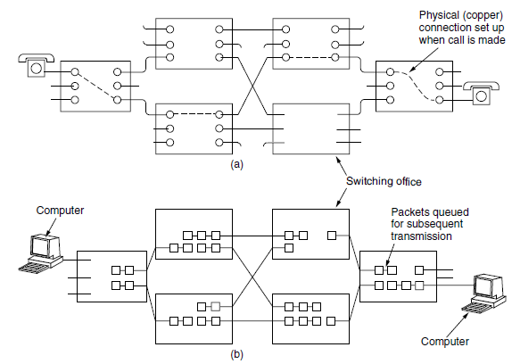

# 九.移动电话系统
已经历了4代：
## 1G：模拟语音

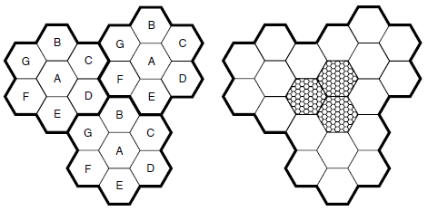

## 2G：数字语音
## 3G：数字语音和数据
## 4G：能够以100Mbps的速度下载
