* Copyright(C)肖文栋教授@北京科技大学自动化学院

# 内容安排
* 3.1 Data Link Layer Design Issues数据链路层设计要点
* 3.2 Error Detection and Correction差错检测和纠正
* 3.3 Elementary Data Link Protocols基本数据链路协议
* 3.4 Sliding Window Protocols滑动窗口协议
* 3.5 Example Data Link Protocols数据链路层协议实例

# 3.1 Data Link Layer Design Issues数据链路层设计问题

## 数据链路层的特定功能：

* 为网络层提供良好的服务接口

Services Provided to the Network Layer

* 成帧Framing

将物理层传输的比特，组织成数据帧

* 差错控制Error Control

处理传输中的差错

* 流量控制Flow Control

调整数据帧的流动速度，使慢速的接收方不被快速的发送方所“淹没”

* 数据包和帧的关系

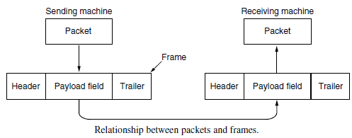

* 数据链路层传送的是帧

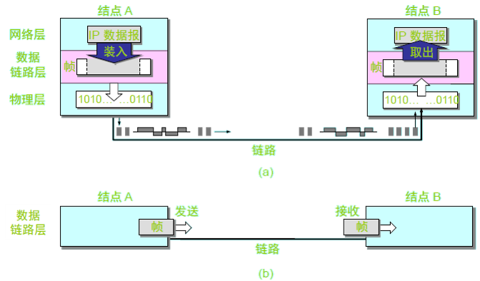

# 3.1.1 Services Provided to the Network Layer为网络层提供的服务

* 虚拟通信与实际通信

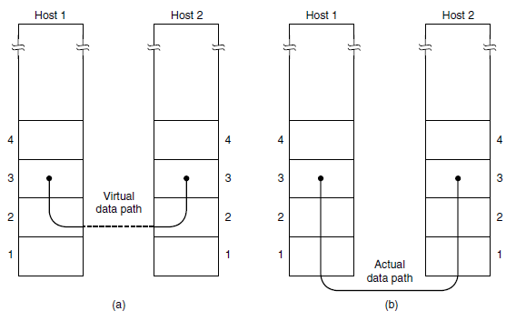

* 数据链路层的简单模型

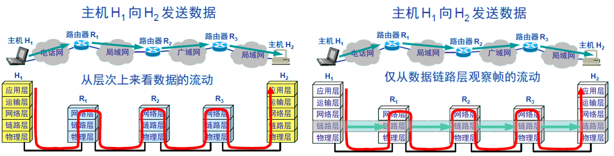

* 概念：数据链路

链路(link)是一条无源的点到点的物理线路段，中间没有任何其他的交换结点。一条链路只是一条通路的一个组成部分。
数据链路(data link) 除了物理线路外，还必须有通信协议来控制这些数据的传输。若把实现这些协议的硬件和软件加到链路上，就构成了数据链路。
-现在最常用的方法是使用适配器（即网卡）来实现这些协议的硬件和软件。
-一般的适配器都包括了数据链路层和物理层这两层的功能。

* 数据链路层的基本功能

数据链路管理，负责在两个相邻结点间建立、维护和拆除链路，并通过差错控制、流量控制将不太可靠的物理链路改造成无差错的数据链路。提高链路的可靠性，为网络通信提供一条在逻辑上无差错的数据链路。

## 三种基本服务

* 无确认的无连接服务：

目的结点不作确认，差错由上层负责；

* 有确认的无连接服务：

目的结点对收到的帧要作确认，发送结点可以知道已发出的帧是否安全到达目的结点；误帧重传；

* 面向连接服务：

可靠地传送数据的服务，即提供在网络实体间建立、维持和释放数据链路的功能；

* 无确认的无连接服务

源机器向目的机器发送独立的帧，而目的机器对收到的帧不做确认。事先没有建立连接，事后也不存在释放。如果由于线路上的噪声而造成帧丢失，数据链路层不做努力去恢复它，恢复工作留给上层去完成。

* 有确认的无连接服务

源机器向目的机器发送独立的帧，而且目的机器对收到的每一帧进行单独确认。仍然不需要建立连接，事后也不存在释放。以这种方式，发送方就可以知道帧是否安全地到达。如果在某个特定的时间间隔内，帧没有到达，就必须重新发送该帧。

* 有确认的面向连接服务

源机器和目的机器在传递任何数据之前，先建立一条连接。在这条连接上所发送的每一帧都被编上号，数据链路层保证所发送的每一帧都确实已收到。而且它保证每帧都收到一次，而且所有的帧都是按正确顺序收到的。
采用无连接服务时，如果确认信息丢失，将会引起一帧多次发送，因此也会收到多次。而面向连接的服务为网络层进程间提供了可靠的传送比特流的服务。

# 3.1.2 Framing 成帧

为了解决可靠成帧问题，提出以下4种成帧的办法：

* 字节记数法；
* 带字节填充的标志字节法；
* 比特填充的标志比特法；
* 物理层编码违例法。

## 成帧方法：字节计数法

用帧头中一个字符表示帧内的字节数。
算法：在每帧的帧头使用一个字段，用来标明帧内的字节数。
例. 1、2、3、4帧的字节数分别为5、5、8、8。

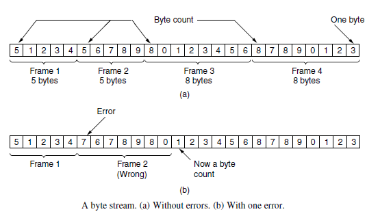

* 字节计数法缺点：字符数可能由于传输差错而被“篡改”，出错。

例. 若第2帧的字符计数值应是5，由于传输差错而被“篡改”为7，致使发送方与接收方不同步，而且无法据此确定下一帧的开始位置。此时，若目的主机已知校验和不正确，但仍无法从出错帧中得知下一帧将从哪里开始。即使向源主机发回“请求重传”的信息也没有用，因为目的主机不知道应该回跳多少字符开始重传。

## 字节填充的标志字节法

每个帧用特殊字节作为开始与结束，即标志字节（flag byte）。
当标志字节出现在数据中时，加入转义字节（ESC）（字节填充）
当转义字节出现在数据中时，其前亦加入转义字节（ESC）

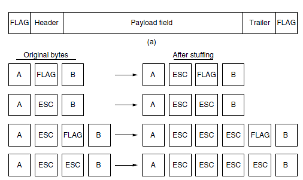

## 比特填充的标志比特法

允许数据帧中包含任意长度的位。
每一帧是用一个特殊的位模式，即01111110 作为开始和结束的标志字节。当发送方的数据链路层在数据中遇到5个连续的1时，为了区分数据和位模式，则自动在数据后插入一个“0”到输出比特流中。这就是比特填充技术。

* 比特填充
* 接收方看到5个连续的“1”，并且后面是“0”时，就自动去掉这个“0”位，使之还原为原始数据。
* 位填充过程对网络层也是完全透明的。
* 在位填充机制中，通过标志模式可以明确地识别出两帧之间的边界。如果接收方失去了帧同步，只需在输入数据流中扫描标志序列即可。

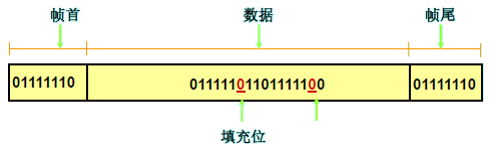

## 物理层编码违禁法

* 只适用于物理层编码有冗余的网络
* 通过物理层的冗余比特（非常规数据）来推断帧的开始和结束.

# 3.1.3 Error Control 差错控制

## 问题：

* 怎样保证所有的帧能正确地交付给目的机器的网络层；

## 常用方法：

* 向数据发送方提供有关接收方接收情况的反馈信息；

## 典型做法：

* 协议要求接收方发回特殊的控制帧，作为对输入肯定或否定的确认。如果发送方收到了关于某* 个帧的肯定确认，则知道此帧已正确到达；一个否认性确认意味着发生了某种差错，相应的帧必须被重传。

## 死锁问题：

* 如果发方发出的数据帧在传输过程中丢失，收方因没有收到数据帧，当然不会向发方发任何应答帧，若发方要等收到应答帧后再发送下一个数据帧，必然永远等待下去，出现死锁。同理，若收方发给发方的应答帧丢失，也会产生死锁。

## 典型做法：

* 发方每发完一个数据帧，就启动一个定时器，若超过定时器所设置的定时时间仍未收到收方的应答帧，则发方重传前面所发送的数据帧。

## 定时时间：

* 一般选为略大于“从发完数据帧到收到应答帧所需的平均时间”。

## 帧的序号：

* 发送方为发送出去的帧分配序号, 这样接收方可根据帧的序号区分原始帧与重传帧.

# 3.1.4 Flow Control 流量控制

* 问题：发送方的传送能力比接受方接受能力大;
* 目的：限制发送方所发送的数据流量，使其发送速率不要超过接收方能处理的速率；
* 解决方法：流量控制;

-基于反馈的流量控制
-基于速率的流量控制（传输层）

* 典型做法：协议中包括一些定义完整的规则，这些规则描述发送方在什么时候发送下一帧，在未获得接收方直接或间接允许之前，禁止发出帧。

# 3.2 Error Detection and Correction差错检测和纠正

## 处理差错的两种基本策略

* 使用纠错码：发送方在每个数据块中加入足够的冗余信息，使得接收方能够判断接收到的数据是否有错，并能纠正错误。
* 使用检错码：发送方在每个数据块中加入足够的冗余信息，使得接收方能够判断接收到的数据是否有错，但不能判断哪里有错。

## 差错类型

* 差错类型：随机错码(independent)、突发错码(burst)
* 信道(channel)类型与差错类型的关系

 随机信道：错码的出现是随机的，且错码之间是统计独立的。
 突发信道：错误成串出现，在一些短促的时间区间内会出现大量错码，而这些短促的时间区间之间却又存在较长的无错码区间。原因：有线信道—脉冲干扰，无线信道—脉冲干扰、衰落。

## 差错控制编码的效用

* (以随机信道为例)假设在随机信道中发送“0”时的错误概率与发送“1”时的相等，都等于p，且p<<1，在码长为n的码组中恰好发生e个错码的概率为


当n=7, p=10-3时，p7(1)≈7*10-3，p7(2)≈2.1*10-5，p7(3)≈3.5*10-8.
* 结论：所采用的差错控制编码，即使仅能纠正(或检测)这种码组中1~2个错误，也可以使误错率下降几个数量级！

# 3.2.1 纠错码

## 码字（codeword）：

一个帧包括m个数据位(信息位)，r个校验位(监督位)，n = m + r，则此n比特单元称为n位码字。

## 海明距离（Hamming distance）：

两个码字之间不同的比特位数目。
  例：0000000000 与0000011111的海明距离为5
  如果两个码字的海明距离为d，则需要d个单比特错就可以把一个码字转换成另一个码字；
  
## 奇偶校验

最简单的例子是奇偶校验，在数据后填加一个奇偶位（parity bit）
 例：使用偶校验（“1”的个数为偶数）
10110101——>101101011
10110001——>101100010
 奇偶校验可以用来检查单个错误。
 
## 纠错码

* 设计纠错码:要求：m个信息位，r个校验位，纠正单比特错；对2^m个有效信息中任何一个，有n个与其距离为1的无效码字，因此有：(n+1) 2^m<=2^n,利用n=m+r，得到(m+r+1)<=2^r
* 给定m，利用该式可以得出校正单比特误码的校验位数目的下界

## 海明码

–码位从左边开始编号，从“1”开始；
–位号为2的幂的位是校验位，其余是信息位；
–每个校验位使得包括自己在内的一些位的奇偶值为偶数（或奇数）。
–为看清数据位k对哪些校验位有影响，将k写成2的幂的和。
–例：11 = 1 + 2 + 8

* 海明码校验位个数

M=7→r=?
7+4+1<2^4,而7+3+1>2^3→r=4,n=m+r=11
换句话说，对m=7的分组码而言，为能纠正一位错码，要求r≥4

* 海明码校验位计算
* 位关系：

3 = 1+2
5= 1+4
6= 2+4
7= 1+2+4
9= 1+8
10= 2+8
11 = 1 + 2 + 8

* 校验位与信息位之间的关系：

a1=a3+a5+a7+a9+a11
a2=a3+a6+a7+a10+a11
a4=a5+a6+a7
a8=a9+a10+a11

* 海明码工作过程

–每个码字到来前，接收方计数器清零；
–接收方检查每个校验位k (k = 1, 2, 4 …)的奇偶值是否正确；
–若第k 位奇偶值不对，计数器加k；
–所有校验位检查完后，若计数器值为0，则码字有效；若计数器值为m，则第m位出错。
–若校验位1、2、8出错，则第11位变反。

* 海明码

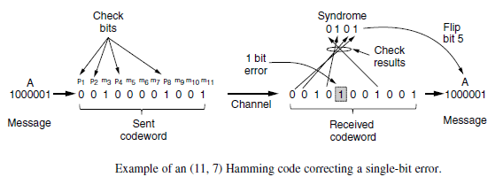

# 3.2.2检错码

## 最简单的检错法：奇偶校验

* 编码规则：

将要传输的数据码元分组，每一组数据后面附加一校验位，使得该组数据连同校验位在内的码中“1”的个数为偶数（偶校验）或奇数（奇校验）。在接收端，按同样的规则检查，如不符，则出差错。

* 如：
```
1011010发送10110100（偶校验）
1011010发送10110101（奇校验）
```

* 检测突发错误

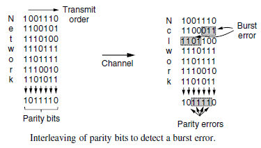

## CRC（Cyclic Redundancy Check）循环冗余校验码/多项式编码

* 基本思想：

先建立应发送的二进制之间的数量关系，即发方对数据帧的二进制数按一定规则运算，产生二进制形式的校验码，随后把这些二进制数一起发送出去，接收方收到後按同样的规则检验这些二进制数之间的关系，从而可判断出传输过程中有无差错发生。

* 具体做法：

收发双方约定一个生成多项式G(x)（其最高阶和最低阶系数必须为1），发送方在帧的末尾加上校验和，使带校验和的帧的多项式能被G(x)整除；接收方收到后，用G(x)除多项式，若有余数，则传输有错。

* 编码与码多项式

在代数编码理论中，为了便于计算，把码组中各码元当作是一个多项式的系数，即把(a(n-1),a(n-2),…,a(1),a(0))(长度为n)的码组表示成：T(x)=a(n-1)x^(n-1)+a(n-2)x^(n-2)+…+a(1)x+a(0)
例: (1100101)的码多项式为x6+x5+x2+1
说明：码多项式中的x仅是码元位的标记，我们并不关心x的取值！

* 模2运算

特点：加法无进位、减法无借位，加、减法相同，与异或等价！1+1=0(无进位)、0-1=1(无借位)

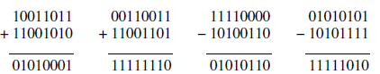

(x^2+1)/(x+1)=x+1,余数为0(x^4+x+1)(x+1)=x^5+x^4+x^2+1,而不是x^5+x^4+x^2+2x+1

* 生成多项式G(x) (generator polynomial)

–G(x)是一个唯一的r阶多项式(r<n)
–发方、收方事前商定；
–生成多项式的高位和低位必须为1
–生成多项式必须比传输信息对应的多项式短。

* CRC码基本思想

–校验和（checksum）加在帧尾，使带校验和的帧的多项式能被G(x)除尽；收方接收时，用G(x)去除它，若有余数，则传输出错。

* 校验和计算算法

–设G(x)为r 阶，在帧的末尾加r 个0，使帧为m + r位，相应多项式为x^rM(x)；
–按模2除法用对应于G(x)的位串去除对应于x^rM(x)的位串，余式R(x)；

–按模2减法从对应于x^rM(x)的位串中减去余数（等于或小于r位），结果就是要传送的带校验和的多项式T(x)→编出的码组T(x)=x^rM(x)+R(x)。

* CRC的检错能力

–发送：T(x)；接收：T(x) + E(x)；
–余数((T(x) + E(x)) / G(x)) = 0 + 余数(E(x) / G(x))
–若余数(E(x) / G(x)) = 0，则差错不能发现；否则，可以发现。
任意一个二进制分组信息串：b0,b1,……bm,都可用一个m阶多项式表示：M(x) =b(0)x^m+b(1)x^(m-1)+……+b(m)；预先选取一个生成多项式G(x)=g(0)x^r+g(1)x^(r-1)+……+1；
-发方发送数据前，对数据进行编码：按模2除法用xrM(x) 除以G(x)，得商多项式Q(x)和余数多项式R(x)；

x^r* M(x) = Q(x) * G(x) + R(x)；T(x) = x^rM(x) –R(x)

-发送方发送编码信息；
-收方收到编码后，再表示成T(x)；
-收方进行校验，如果T(x)/G(x)的余数R(x)不为0，则传输有错，否则传输正确；
-取数据信息；把收到的正确编码信息去掉尾部，即数据信息。

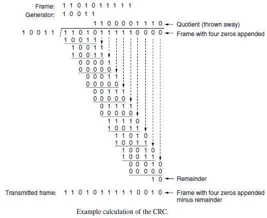

* CRC码可以用软件实现，但通常用硬件实现CRC的编码、译码和判错；
* 数学分析表明，当G(x)具有某些特点，才能检测出各种不同错误。为了能对不同场合下的各种错误模式进行校验，已经研究出了几种CRC生成多项式的国际标准。
* 三个国际标准：

CRC-16: X^16+X^15+X^2+1
CRC-CCITT:X^16+X^12+X^5+1
CRC-32: X^32+X^26+X^23+X^22+X^16+X^12+X^11+X^10+X^8+X^7+X^5+X^4+X^2+X^1+1

# 3.3基本的数据链路层协议

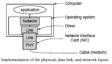

## Assumptions
* physical layer, data link layer, network layer are independent processes. 进程通信类型：消息传递
* 链路层希望为网络层提供可靠的面向连接的服务(发送长数据流)

## Protocol Definitions

```c
/*自己敲了一遍，有可能敲得不准，凑合看:protocol.h*/
/*Some definitions needed in the protocols(protocol.h)*/

#define MAX_PKT 1024 /*determines packet size in bytes*/      

typedef enum{false,true}boolean;   /*boolean type*/
typedef unsigined int seq_nr;      /*sequence or ack numbers*/
typedef struct{unsigined char data[MAX_PKT];}packet; /*packet defintion*/
tyoedef enum{data,ack, nak}frame_kind;  /*frame_kind defintion*/

typedef struct {     /*frames are transported in this layer*/

    frame_kind kind; /*what kind of grame is it?*/
    seq_nr seq;      /*sequence number*/
    seq_nr ack;      /*acknowledgement number*/
    packet info;     /*the network layer packet*/

}frame;

/*wait for an event to happen; return its type in event*/
void wait_for_event(event_type *event);

/*Fetch a packet from the nework layer for transmission on the channel*/
void from_network_layer(packet *p);

/*deliver information from an inbound frame to the network layer*/
void to_network_layer(packte *p);

/*go get an inbound frame from the physica layer and copy it to r*/
void from_physical_layer(frame *r);

/*pass the frame to the physical layer for transmission*/
void to_physical_layer(frame *p);

/*start the clock running and enable the timeout event*/
void start_timer(seq_nr k);

/*stop the clock and disable the timeout event*/
void stop_timer(seq_nr k);

/*start an auxiliary timer and enable the ack_timeout event*/
void start_ack_timer(void);

/*stop the auxiliary timer and disable the ack_timeout event*/
void stop_ack_timer(void);

/*allow the network layer to cause a network_layer_ready event*/
void enable_network_layer(void);

/*forbid the network layer from causing a network_layer_reasy event*/
void disable_network_layer(void);

/*macro inc is expanded in-line: increment k circularly*/
#define inc(k) if(k<MAX_SEQ)k=k+1;else k=0;
```

# 3.3.1 一个乌托邦式的单工协议（AUtopianSimplex Protocol）

## 工作在理想情况(Utopian，不现实，无流量控制、纠错等)

* –单向传输：one direction, sender→ receiver
* –发送方无休止工作（要发送的信息无限多）
* –接收方无休止工作（缓冲区无限大）：发送、接收双方网络层总是处于就绪状态，无限缓冲则无需flow control
* –通信线路（信道）不损坏或丢失信息帧：无需重发、计时、应答、序号等

## 工作过程

* –发送程序:取数据，构成帧，发送帧；
* –接收程序：等待，接收帧，送数据给高层

## 乌托邦式的单工协议的实现

```c
/**
 * Protocol 1 (Utopia) privides for data transmission in one direction only, 
 * from sender to receiver. The communication channel is assumed to be error
 * free and the receiver  is assumed to be able to process all the input 
 * infinitely quickly. Consequently, the sender just sits in a loop pumping 
 * data out onto the line ad fast ad it can.
 */
 
typedef enum{frame_arrival}event_type;
#include "protocol.h"

void sender1(void)
{
    frame s;                        /*buffer for an outbound frame*/
    packet buffer;                  /*buffer for an outbound packet*/
    
    while(true){  
        from_network_layer(&buffer);/*go get something to send*/
        s.info = buffer;            /*copy it into s for transmission*/
        to_physical_layer(&s);      /*tomorrow, and tomorrow, and tomorrow,
                                      creeps in this petty pace from day to day 
                                      To the last syllable fo recorded time.
                                            --Macbeth. V. v */
    }   
}

void receiver1(void)
{
    frame r;
    event_type  event;              /*filled in by wait, but not used here*/
    
    while(true)
    {
        wait_for_event(&event);     /*only possibility is frame_arrival*/
        from_physical_layer(&r);    /*go get the inbound frame*/
        to_network_layer(&r.info);  /*pass the data to the network layer*/
    }
}

```

# 无错信道上的单工停等协议

A Simplex Stop-and-WaitProtocol for a Error-Free Channel

## 目的：Flow control

* 增加约束条件：接收方不能无休止接收。
* 解决办法：接收方每收到一个帧后，给发送方回送一个响应。
* 工作过程
–发送程序：取数据，成帧，发送帧，等待响应帧；
–接收程序：等待，接收帧，送数据给高层，回送响应帧。

## 无错信道上的单工停等协议（实现）

```c
/**
 * protocol 2 (stop-and-wait) also privides for a one-directional 
 * flow of data from sender to receiver. The communication channel
 * is once ageain assumed to be error free, as inprotocol 1.
 * However, this time the receiver has only a finite buffer capacity
 * and a finite processing speed, so the protocol mast explicitly 
 * prevent the sender from flooding the receiver with data faster 
 * than it can be handled.
 */
 
typedef enum{frame_arrival}event_type;
#include "protocol.h"

void sender2(void)
{
    frame s;                        /*buffer for an outbound frame*/
    packet buffer;                  /*buffer for an outbound packet*/
    event_type event;               /*frame_arrival is the only possibility*/
    
    while(true){  
        from_network_layer(&buffer);/*go get something to send*/
        s.info = buffer;            /*copy it into s for transmission*/
        to_physical_layer(&s);      /*bye-bye little frame*/
        wait_for_event(&event);     /*do not proceed until given the go ahead*/
    }   
}

void receiver2(void)
{
    frame r,s;                      /*buffers for frames*/
    event_type  event;              /*frame_arrival is the only possibility*/
    
    while(true)
    {
        wait_for_event(&event);     /*only possibility is frame_arrival*/
        from_physical_layer(&r);    /*go get the inbound frame*/
        to_network_layer(&r.info);  /*pass the data to the network layer*/
        to_physical_layer(&s);      /*send a dummy frame to awaken sender*/
    }
}
```

# 3.3.3 有噪声信道的单工停等协议

A Simplex Stop-and-WaitProtocol for a Noisy Channel

* 增加约束条件：信道可能会出错，帧可能会被损坏或丢失。
* 解决办法：出错重传。
* 带来的问题：

–什么时候重传——定时
–重复帧怎么办——发送帧头中放入序号
–为了使帧头精简，序号取多少位—--1位，模2增1

* 发方在发下一个帧之前等待一个肯定确认的协议叫做带有重传的肯定确认（PAR，Positive Acknowledgement with Retransmission）或自动重复请求（ARQ，Automatic Repeat reQuest）

## 有噪声信道的单工停等协议

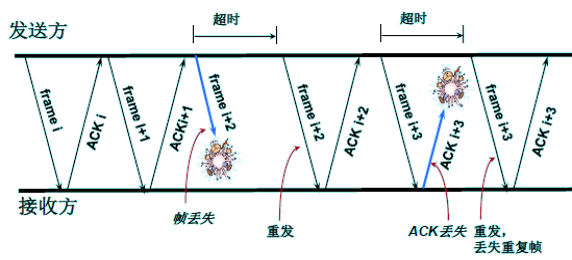

## 带有重传机制的肯定确认机制

A positive acknowledgement with retransmission protocol

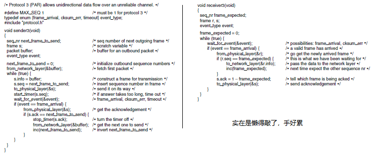

# 3.4滑动窗口协议Sliding Window Protocol

* 单工——> 全双工
* 捎带确认（piggybacking）：暂时延迟待发确认，以便附加在下一个待发数据帧的技术。

–优点：充分利用信道带宽，减少帧的数目意味着减少“帧到达”中断；
–带来的问题：复杂。

* 本节的三个协议统称滑动窗口协议，都能在实际（非理想）环境下正常工作，区别仅在于效率、复杂性和对缓冲区的要求。

## 滑动窗口协议工作原理

* 发送的信息帧都有一个序号，从0到某个最大值，0~2^n-1，一般用n个二进制位表示；
* 发送端始终保持一个已发送但尚未确认的帧的序号表，称为发送窗口。发送窗口的上界表示要发送的下一个帧的序号，下界表示未得到确认的帧的最小编号。发送窗口大小= 上界-下界，大小可变；
* 发送端每发送一个帧，序号取上界值，上界加1；每接收到一个正确响应帧，下界加1；
* 接收端有一个接收窗口，大小固定，但不一定与发送窗口相同。接收窗口的上界表示允许接收的序号最大的帧，下界表示希望接收的帧；
* 接收窗口容纳允许接收的信息帧，落在窗口外的帧均被丢弃。序号等于下界的帧被正确接收，并产生一个响应帧，上界、下界都加1。接收窗口大小不变。

## 大小为1的滑动窗口

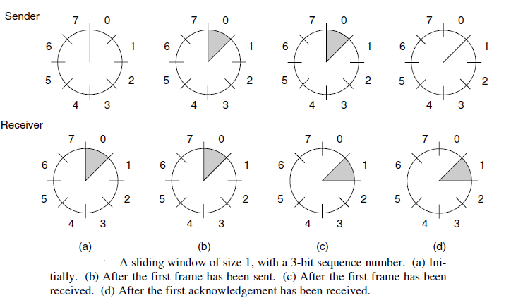

## 一比特滑动窗口协议A One Bit Sliding Window Protocol

* 协议特点
* 窗口大小：N = 1，发送序号和接收序号的取值范围：0，1；
* 可进行数据双向传输，信息帧中可含有确认信息（piggybacking技术）；
* 信息帧中包括两个序号域：发送序号和接收序号（已经正确收到的帧的序号）

## A 1-bit sliding windows protocol

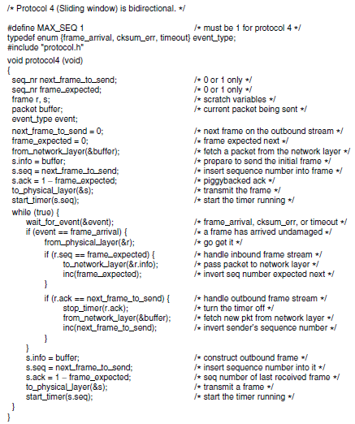

## 一比特滑动窗口协议A One Bit Sliding Window Protocol

* 存在问题：能保证无差错传输，但是基于停等方式；若双方同时开始发送，则会有一半重复帧；效率低，传输时间长。
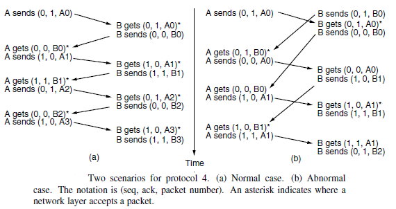

# 3.4.2退后n帧协议A Protocol Using Go-Back-n

## 为提高传输效率而设计

* 例：–卫星信道传输速率50kbps，往返传播延迟500ms，若传1000bit的帧，使用协议4，则传输一个帧所需时间为：发送时间+ 信息信道延迟+ 确认信道延迟（确认帧很短，忽略发送时间）= 1000bit / 50kbps + 250ms + 250ms = 520ms；信道利用率=20/520约等于4%
* 一般情况：–信道带宽b比特/秒，帧长度L比特，往返传播延迟R秒，则信道利用率为(L/b)/(L/b+R)=L/(L+ Rb)

* 结论：–传输延迟大，信道带宽高，帧短时，信道利用率低。

## 提高效率方法

* 解决办法：连续发送多帧后再等待确认，称为流水线技术（pipelining）。
* 带来的问题：信道误码率高时，对损坏帧和非损坏帧的重传非常多
* 两种基本方法:退后n协议（go-back-n）;选择重传（selective repeat）

## 退后n协议

* 接收方从出错帧起丢弃所有后继帧；
* 接收窗口为1；
* 对于出错率较高的信道，浪费带宽。

## 选择重传（selective repeat）

* 接收窗口大于1，先暂存出错帧的后继帧；
* 只重传坏帧；
* 对最高序号的帧进行确认；
* 接收窗口较大时，需较大缓冲区。

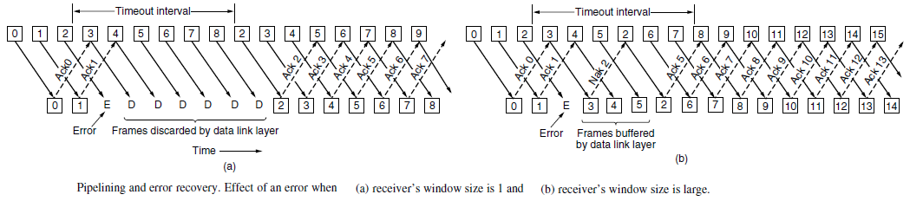

# 3.5数据链路层协议实例

## 点到点协议PPP ——Point-to-Point Protocol

* RFC 1661 & RFC 1662
* PPP提供差错校验、支持多种协议、允许动态分配IP地址、支持身份认证等。
* 提供3个主要特性：

–一种成帧方法，面向字符的，采用字符填充技术
–一种链路控制协议LCP（Link Control Protocol），用于启动线路、测试线路、协商参数、关闭线路
–一种协商网络层选项的方式，针对每一种支持的网络层都有相应的网络控制协议NCP（Network Control Protocol）, 可支持多种网络层协议。

## PPP 协议的帧格式

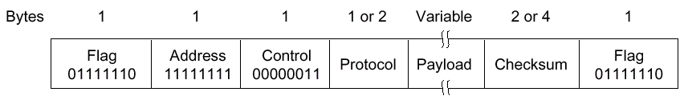

* 标志字段, 0x7E （01111110）。
* 地址字段, 只置为0xFF。表示所有站点都应接受该帧。
* 控制字段, 通常置为0x03，表示无编号帧。
* 协议：指示净负荷中是何种包，缺省大小为2个字节。

–当协议字段为0x0021 时，PPP 帧的信息字段就是IP 数据报。
–若为0xC021, 则信息字段是PPP 链路控制数据。
–若为0x8021，则表示这是网络控制数据。

* 净负荷字段：可变长度，缺省为1500字节；
* 校验和字段：2或4个字节

## PPP中的字符填充

* 将信息字段中出现的每一个0x7E 字节转变成为2 字节序列(0x7D, 0x5E)。
* 若信息字段中出现一个0x7D 的字节, 则将其转变成为2 字节序列(0x7D, 0x5D)。
* 若信息字段中出现ASCII 码的控制字符（即数值小于0x20 的字符），则在该字符前面要加入一个0x7D 字节，同时将该字符的编码加以改变（XOR操作）。

## 用户到ISP 的链路使用PPP 协议

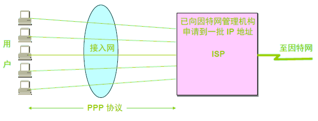

## PPP 协议的工作状态

* 当用户拨号接入ISP 时，路由器的调制解调器对拨号做出确认，并建立一条物理连接。
* PC 机向路由器发送一系列的LCP 分组（封装成多个PPP 帧）。
* 这些分组及其响应选择一些PPP 参数，和进行网络层配置，NCP 给新接入的PC机分配一个临时的IP 地址，使PC 机成为因特网上的一个主机。
* 通信完毕时，NCP 释放网络层连接，收回原来分配出去的IP 地址。接着，LCP 释放数据链路层连接。最后释放的是物理层的连接。
