*《计算机网络》第四章：介质访问控制（The Medium Access Control Sublayer）

* Copyright(C)肖文栋教授@北京科技大学自动化学院

# 内容安排
4.1 信道分配问题The Channel Allocation Problem
4.2 多路访问协议Multiple Access Protocols
4.3 以太网Ethernet
4.4 无线局域网Wireless LANs
4.5 宽带无线Broadband Wireless
4.6 蓝牙Bluetooth
4.7 RFID
4.8 数据链路层交换Data Link Layer Switching

# 本章讨论的问题
## 网络链路分为：
点到点连接、采用广播信道
## 广播网络中的关键问题：
当信道的使用产生竞争时，如何确定谁可以使用信道——介质访问控制方法，控制多个结点利用公共传输介质发送和接收数据的方法；
## 介质访问子层：
数据链路层的子层(底部)，决定广播信道中信道分配。

## 4.1信道分配问题

* 信道分配方法有两种：静态分配、动态分配

## 静态信道分配

* 频分多路复用FDM（波分复用WDM）

原理：将频带平均分配给每个要参与通信的用户；
优点：适合于用户较少，数目基本固定，各用户的通信量都较大的情况；
缺点：无法灵活地适应站点数及其通信量的变化。

* 时分多路复用TDM

原理：每个用户拥有固定的信道传送时槽；
优点：适合于用户较少，数目基本固定，各用户的通信量都较大的情况；
缺点：无法灵活地适应站点数及其通信量的变化。

## 动态信道分配的假设

* 信道分配模型的五个基本假设：
* 流量独立：每个站点是独立的，并以统计固定的速率产生帧，一帧产生后到被发送走之前，站点被封锁。能帮助分析协议。
* 单信道假设：所有的通信都是通过单一的信道来完成的，各个站点都可以从信道上收发信息。
* 冲突可观察：若两帧同时发出，它们在时间上就重叠，由此产生的信号是混乱的，称为冲突。所有的站点都能检测到冲突，冲突帧必须重发。除了因冲突而产生错误外，不会再有其它的错误。
* 时间连续或分槽：帧的传输只能从某个时间槽的起始点开始，一个时间槽可能包含0, 1或多个帧。
* 载波侦听或非载波侦听（确定能否发送）。

## 4.2 多路访问协议Multiple Access Protocols

多路访问协议是指多个用户共用一条信道的协议。

* 载波监听(Carrier Sense)的思想是：站点在发送帧访问传输信道之前，首先监听信道有无载波，若有载波，说明已有用户在使用信道，则不发送帧以避免冲突。多路访问(Multiple Access)是指多个用户共用一条线路。

## 4.2.1 ALOHA

* 70年代，美国夏威夷大学Norman Abramson设计了ALOHA协议

-目的：解决信道的动态分配，基本思想可用于任何无协调关系的用户争用单一共享信道使用权的系统；
-将讨论的两个版本：纯ALOHA和分槽ALOHA

* 纯ALOHA

基本思想：用户有数据要发送时，可以直接发至信道；然后监听信道看是否产生冲突，若产生冲突，则等待一段随机的时间重发;
只要用户有数据待发，就让他们发；
无线信道为无差错信道；
在某时间间隔内如只有一个用户发送帧，中央计算机接收后通过另一独立信道发回应答信号(ACK)。

## 分槽ALOHA协议

* 基本思想：把信道时间分成离散的时间槽，槽长为一个帧所需的发送时间。每个站点只能在时槽开始时才允许发送。其他过程与纯ALOHA协议相同。

* 信道效率

–冲突危险区较纯ALOHA大幅降低；
–与纯ALOHA协议相比，降低了产生冲突的概率，信道利用率最高为36.8%。

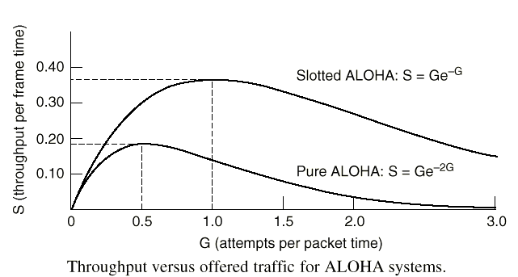

## 4.2.2 载波侦听多路访问协议Carrier Sense Multiple Access Protocols

* 采用分隙ALOHA协议时，只控制了信道的分隙，对结点的发送过程不进行任何控制，因而吞吐率只能达到36.8%。
* 载波侦听多路访问协议要求网络各站点侦听载波是否存在（即有无传输），并执行相应动作的协议。提出“先听后说”的方法，是对ALOHA的一种改进协议。
* 基本思想：每个站在发送数据前，先侦听信道上有无其他站正在发送信息。如果没有，则发送数据；如果有，则暂不发送，退避一段时间后再尝试。
* 根据侦听策略的不同，分为三种：

-1-坚持CSMA（1-persistent CSMA）
-非坚持CSMA。
-P-坚持CSMA

* 1-坚持型CSMA（1-persistent CSMA）

原理
–若站点有数据发送，先监听信道；
–若站点发现信道空闲，则发送；
–若信道忙，则继续监听直至发现信道空闲，然后完成发送；
–若产生冲突，等待一随机时间，然后重新开始发送过程。
优点：减少了信道空闲时间
缺点：
–增加了发生冲突的概率
–广播延迟对协议性能的影响：广播延迟越大，发生冲突的可能性越大，协议性能越差

* 非坚持型CSMA（nonpersistent CSMA）

原理
–若站点有数据发送，先监听信道；
–若站点发现信道空闲，则发送；
–若信道忙，等待一随机时间，然后重新开始发送过程；
–若产生冲突，等待一随机时间，然后重新开始发送过程。
优点：减少了冲突的概率；
缺点：增加了信道空闲时间，数据发送延迟增大
信道效率比1-坚持CSMA高，传输延迟比1-坚持CSMA大。

* p-坚持型CSMA（p-persistent CSMA）

适用于分槽信道
原理
–若站点有数据发送，先监听信道；
–若站点发现信道空闲，则以概率p发送数据，以概率q =1-p 延迟至下一个时槽发送。若下一个时槽仍空闲，重复此过程，直至数据发出或时槽被其他站点所占用；
–若信道忙，则等待下一个时槽，重新开始发送；
–若产生冲突，等待一随机时间，然后重新开始发送。

## 五种CSMA多路访问协议性能比较

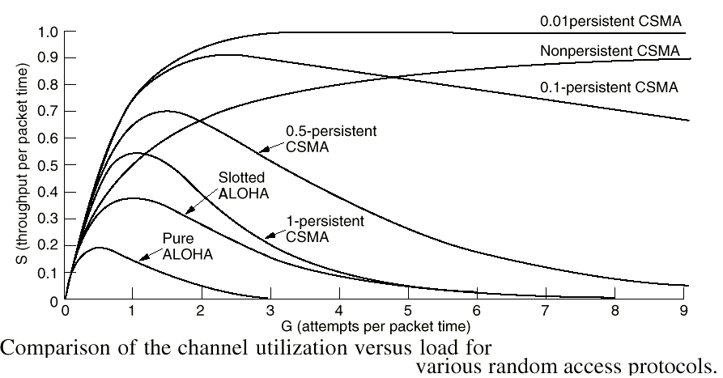

## 带冲突检测的CSMA

* CSMA/CD的引入原因

当两个帧发生冲突时，两个被损坏帧继续传送毫无意义，而且信道无法被其他站点使用，对于有限的信道来讲，这是很大的浪费。如果站点边发送边监听，并在监听到冲突之后立即停止发送，可以提高信道的利用率，因此产生了CSMA/CD

* CSMA/CD工作状态–传输期–竞争期–空闲期

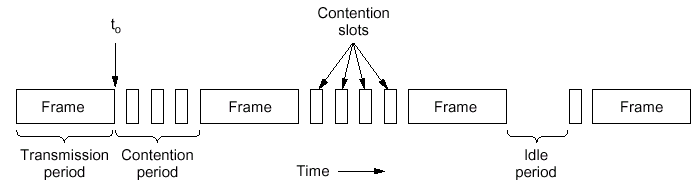

## CSMA/CD先听后说，边说边听，冲突停止，延时再发

* 先听后说——源站点在发送数据帧之前，首先要侦听信道是否忙，若侦听到信道忙，即信道上有载波信号，则推迟发送，等待信道恢复到空闲状态。
* 边说边听——源站点采用边发送边侦听的技术，侦听有没有表示冲突发生的干扰信号。
* 冲突停止——若侦听到有干扰信号，就表示信道上传输的数据发生了冲突，于是源站点就立即停止发送。为了通知卷入冲突的其他站点发生了冲突，源站点首先迅速发送一串阻塞信号，进行线路报警。
* 延时再发——卷入冲突的站点等待一段随机时间，然后重复上述动作准备重发受到冲突的数据帧。

## 4.2.3 无冲突协议Collision-Free Protocols

## 基本位图协议（Bit-Map Protocol）

–工作原理

* 共享信道上有N个站，竞争周期分为N个时槽，如果一个站有帧发送，则在对应的时槽内发送比特1；
* N个时槽之后，每个站都知道哪个站要发送帧，这时按站序号发送。

## 基本位图协议（Bit-Map Protocol）

* 象这样在实际发送信息前先广播发送请求的协议称为预留协议（reservation protocol）
* 效率:–低负载下，效率为d / (N + d)，数据帧由d位构成；–高负载下，效率为d / (d + 1)。
* 缺点:–与站序号有关的不平等性，序号大的站得到的服务好；–每个站都有1 比特的开销。

## 令牌传递（Token Ring）

通过传递令牌以预定义的顺序轮流发送帧。令牌代表了发送权限

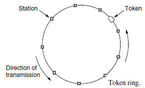

## 二进制倒计数（Binary Countdown）

* 工作原理

–所有站的地址用等长二进制位串表示，若要占用信道，则广播该位串；
–不同站发的地址中的位做“或”操作，一旦某站了解到比本站地址高位更高的位置被置为“1”，便放弃发送请求。
–赢得竞争后可传送一帧

* 效率:d / (d + logN)

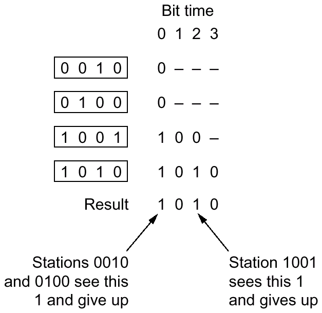

## 4.2.2 有限竞争协议（Limited-Contention Protocols）

占用信道的策略

* 竞争方法

–例，CSMA；
–轻负载下，发送延迟小；重负载下，信道效率低。

* 无冲突方法

–例，基本位图法；
–轻负载下，发送延迟大；重负载下，信道效率高。

* 有限竞争方法

–结合以上两种方法，轻负载下使用竞争，重负载下使用无冲突方法。
–减少竞争的站的数目可以增加获取信道的概率；
–基本思路：将站分组，组内竞争

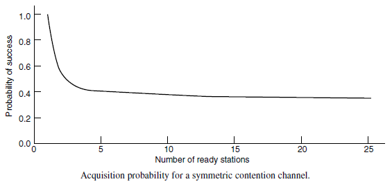

## 有限竞争协议基本原理

* 将诸站点分成若干组，
* 在slot0，group 0的成员参加竞争，如其中之一成功，它就获得信道并传送它的帧；
* 若在slot0无站点发送或发生冲突，则group1的成员在slot1时参加竞争。

## 自适应树遍历协议（The Adaptive Tree Walk Protocol）

* 工作原理

–站点组织成二叉树；
–一次成功传输之后，第0槽全部站可竞争信道，只有一个站要使用信道则发送；有冲突则在第1槽内半数站（2以下站）参与竞争。如其中之一获得信道，本帧后的时槽留给3以下的站；如发生冲突，继续折半搜索。

* 当系统负载很重时，从根结点开始竞争发生冲突的概率非常大。为提高效率，可以从中间结点开始竞争。问题：搜索应该从树的哪一级开始？

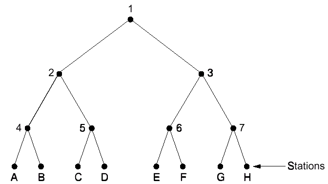

A、G要求发送slot0:冲突；slot1:左子树，A成功；slot2:右子树,G成功
A、Cslot0:冲突；slot1:冲突；slot2:A成功；slot3:C成功
C、Dslot0:冲突；slot1:冲突；slot2：空闲；slot3:冲突；slot4:C; slot5: D
G、Hslot0:冲突;slot1:空闲;slot2:冲突; slot3:空闲; slot4:冲突; slot5:G ;slot6:H

## 4.2.5无线局域网协议

## 无线局域网与有线局域网不同，具有
* 隐藏站点问题（hidden station problem）由于站点距离竞争者太远，从而不能发现潜在介质竞争者的问题称为隐藏站点问题。
* 暴露站点问题（exposed station problem）由于非竞争者距离发送站点太近，从而导致介质非竞争者不能发送数据的问题称为暴露站点问题。

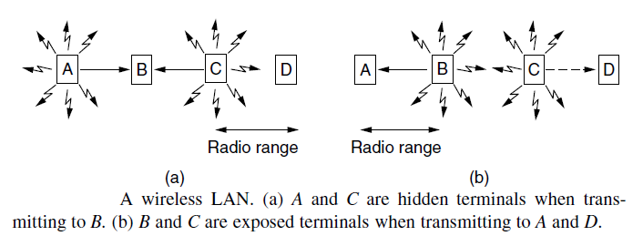

## 冲突避免多路访问MACA，Multiple Access with Collision Avoidance

* 基本思想：发送站点刺激接收站点发送应答短帧，从而使得接收站点周围的站点监听到该帧，并在一定时间内避免发送数据

* 基本过程

–A向B发送RTS（Request To Send）帧，A周围的站点在一定时间内不发送数据，以保证CTS帧返回给A；
–B向A回答CTS（Clear To Send）帧，B周围的站点在一定时间内不发送数据，以保证A发送完数据；
–A开始发送
–若发生冲突(两站点同时发送RTS)，则等待随机时间，再重试。

## 4.3 ETHERNET

* Classic Ethernet Physical Layer
* Classic Ethernet MAC Sublayer Protocol
* Switched Ethernet
* Fast Ethernet
* Gigabit Ethernet
* 10-Gigabit Ethernet

## 分类：
* 经典以太网，运行速度：3-10Mbps
* 交换式以太网，使用了交换机，运行速度：100, 1000, and 10,000 Mbps,称为：高速以太网, 千兆以太网, 万兆以太网,以太网和802.3几乎完全一致

## Classic Ethernet Physical Layer

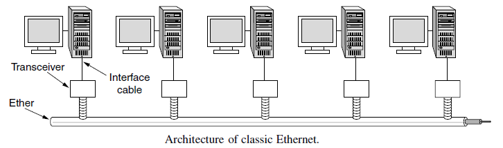

传统以太网最初是使用粗同轴电缆，后来演进到使用比较便宜的细同轴电缆，最后发展为使用更便宜和更灵活的双绞线。

* 以太网的规范写法：

## Classic Ethernet MAC Sublayer Protocol

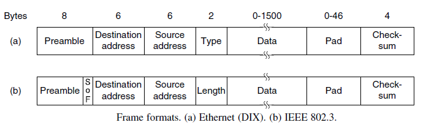

* 前导序列: 7个字节10101010+帧开始标志（1字节，10101011）
* 目的地址和源地址, 6个字节，目的地址第一位为0，表示普通地址；为1，表示组地址，支持multicast，目的地址全1，为广播地址。
* 有效帧长至少64字节
* 填充字段保证最小长度要求

## 二进制指数后退的CSMA/CDCSMA/CD with binary exponential backoff

* 将冲突发生后的时间划分为长度为51.2微秒的时槽
* 发生第一次冲突后，各个站点等待0 或1 个时槽再开始重传；
* 发生第二次冲突后，各个站点随机地选择等待0, 1, 2或3个时槽再开始重传；
* 第i次冲突后，在0 至2i-1 间随机地选择一个等待的时槽数，再开始重传；
* 10次冲突后，选择等待的时槽数固定在0至210-1间；
* 16次冲突后，发送失败，报告上层。

## 以太网交换机

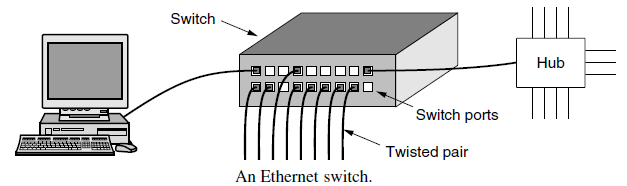

* 以太网交换机的每个接口都直接与主机相连，并且一般都工作在全双工方式。
* 交换机能同时连通许多对的接口，使每一对相互通信的主机都能像独占通信媒体那样，进行无碰撞地传输数据。
* 以太网交换机由于使用了专用的交换结构芯片，其交换速率就较高。

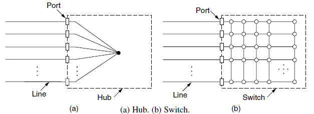

* 集线器只是在电气上简单地连接所有线
* 交换机把帧输出到该帧想去的端口

## 高速以太网

* 速率达到或超过100 Mbps 的以太网称为高速以太网。
* 在双绞线上传送100 Mbps 基带信号的以太网，仍使用IEEE 802.3 的CSMA/CD 协议。称其为快速以太网(Fast Ethernet)。

## 千兆以太网

* 允许在1 Gb/s 下全双工和半双工两种方式工作。
* 使用802.3 协议规定的帧格式。
* 在半双工方式下使用CSMA/CD 协议（全双工方式不需要使用CSMA/CD 协议）。
* 与10BASE-T 和100BASE-T 技术向后兼容。

* 千兆以太网的物理层

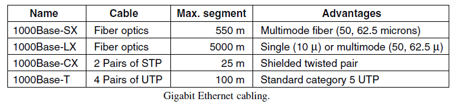

## 万兆以太网

* 万兆以太网与10 Mb/s，100 Mb/s 和1 Gb/s 以太网的帧格式完全相同。
* 万兆以太网还保留了802.3 标准规定的以太网最小和最大帧长，便于升级。
* 万兆以太网只工作在全双工方式，因此没有争用问题，也不使用CSMA/CD 协议。

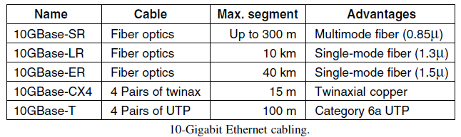

## 端到端的以太网传输

* 万兆以太网的出现，以太网的工作范围已经从局域网（校园网、企业网）扩大到城域网和广域网，从而实现了端到端的以太网传输。
* 这种工作方式的好处是：

–成熟的技术
–互操作性很好
–在广域网中使用以太网时价格便宜。
–统一的帧格式简化了操作和管理。

## 以太网从10 Mbps 到10 Gbps 的演进

以太网从10 Mb/s 到10 Gb/s 的演进证明了以太网是：

* 可扩展的（从10 Mb/s 到10 Gb/s）。
* 灵活的（多种传输媒体、全/半双工、共享/交换）。
* 易于安装。
* 稳健性好。

## 4.4 Wireless LANs

* The 802.11 Architecture and Protocol Stack
* The 802.11 Physical Layer
* The 802.11 MAC Sublayer Protocol
* The 802.11 Frame Structure
* Services

## 4.4.1 The 802.11 Architectureand Protocol Stack

PCF(Point Coordination Function)and DCF (Distributed Coordination Function)

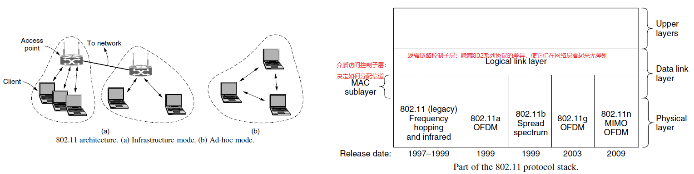

## 4.4.2 802.11 物理层

* 802.11b: 支持1,2,5.5,11Mbps速率,工作在2.4GHz ISM频段,采用扩频方法BPSK,QPSK,CCK等编码技术
* 802.11a: 支持54Mbps速率,工作在5GHz ISM频段, 基于OFDM(正交频分复用)
* 802.11g: 支持54Mbps速率,工作在2.4G HzISM频段, 基于OFDM(正交频分复用)
* 802.11n: 支持100Mbps速率,采用4根天线,MIMO及OFDM技术

* CSMA with Collision Avoidance (CSMA/CA)

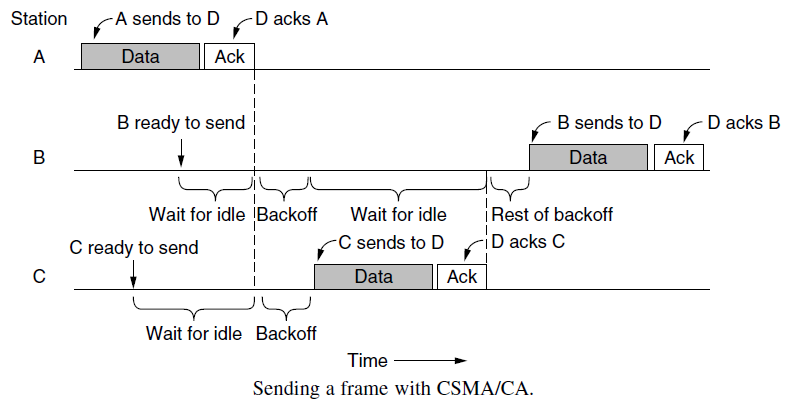

## 4.4.3 The802.11 MAC Sublayer Protocol

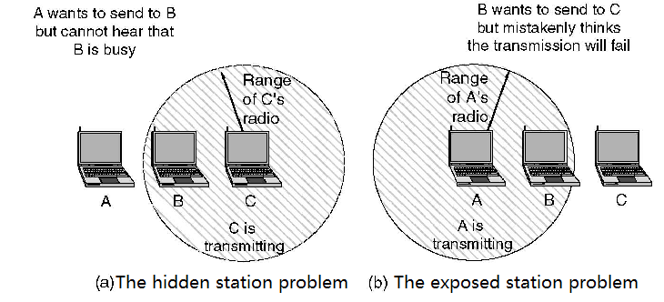

## 使用CSMA/CA的虚拟信道侦听

* 使用RTS/CTS机制
* 通过网络分配向量（NAV）跟踪信道使用时间
* 不能解决Exposed Terminal 问题

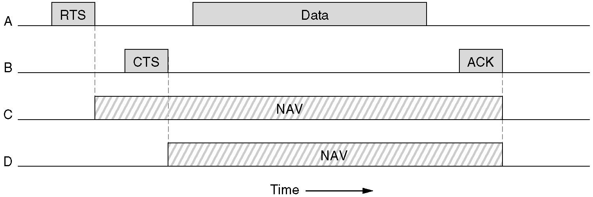

## 802.11e: 具有QoS的802.11

* SIFS: Short InterFrame Spacing
* DIFS: DCF InterFrame Spacing
* AIFS: Arbitration InterFrame Space
* EIFS: Extended InterFrame Spacing

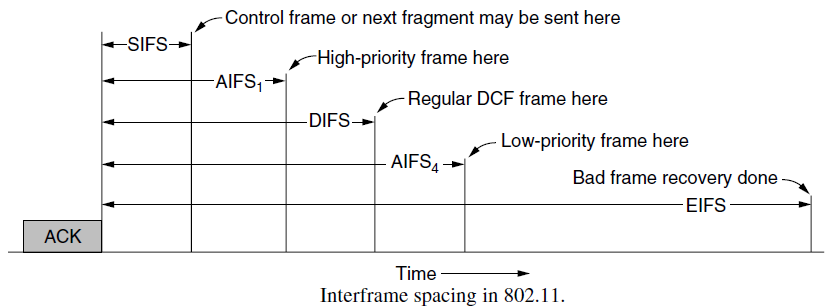

## 4.4.4 The 802.11 Frame Structure

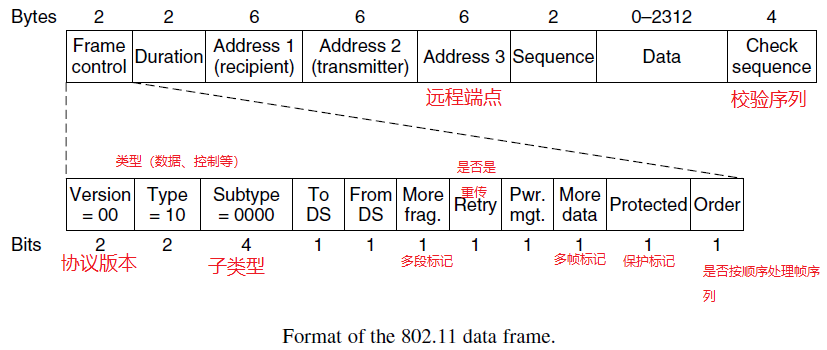

## 4.4.4 802.11 Services

* Association
* Disassociation
* Reassociation
* Authentication (认证)
* Privacy（隐私，通过加密实现）
* Data Delivery（数据传送）
* Distribution（分发，如何路由）
* QoS traffic scheduling
* Transmit power control
* Dynamic frequency selection

## Bluetooth

* Bluetooth Architecture
* Bluetooth Applications
* The Bluetooth Protocol Stack
* The Bluetooth Radio Layer
* The Bluetooth Link Layers
* The Bluetooth Frame Structure

## Bluetooth Architecture

* 基本单元为微网piconet, 包含一个主节点及10米内至多7个活跃的从节点，还可以有多达255个驻留节点（只相应主节点的激活或信标信号）。
* 多个微网可同时共存，也可通过桥节点连接起来，构成散网。
* 微网是一个集中式的TDM系统，所有通信是在主从节点之间进行，从节点间不直接通信。

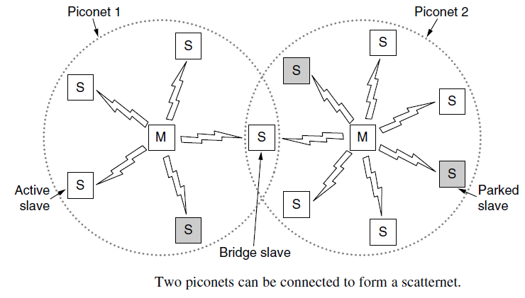

## Bluetooth Applications

可支持25种应用程序，将这些应用称为轮廓(profile)。

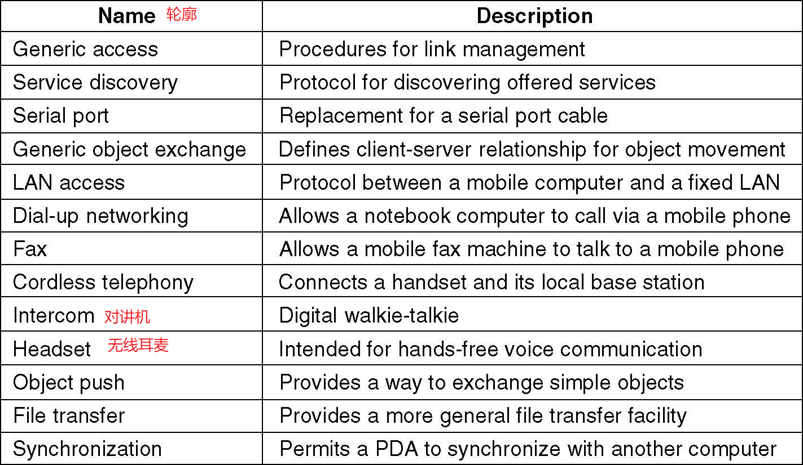

## The Bluetooth Protocol Stack

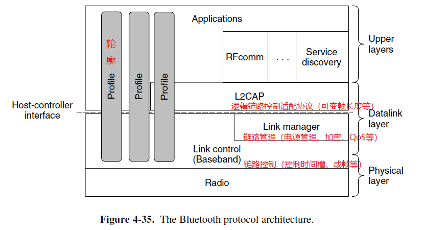

## The Bluetooth Radio Layer

* Range of 10 meters operating in the same 2.4-GHz ISM band. 79个信道，每个信道宽1MHz。
* To coexist with other networks using the ISM band, frequency hopping spread spectrum（调频扩展）is used. There can be up to 1600 hops/s over slots with a dwell(驻留) time of 625 μsec.
* 采用自适应跳频以减少干扰。
* 基本方案使用频移键控，提供1Mbps的总数据速率。
* 蓝牙2.0使用相移键控，提供2M或3Mbps的总数据速率。

## The Bluetooth Data Layer

* The master in each piconet defines a series of 625-μsec time slots, with the master’s transmissions starting in the even slots and the slaves’ transmissions starting in the odd ones.
* Pairing (配对)并建立链路
* L2CAP层从上层接收数据包，拆分成帧或重组，处理多个数据包的多路复用与分用，差错控制和重传等。

## The Bluetooth Frame Structure

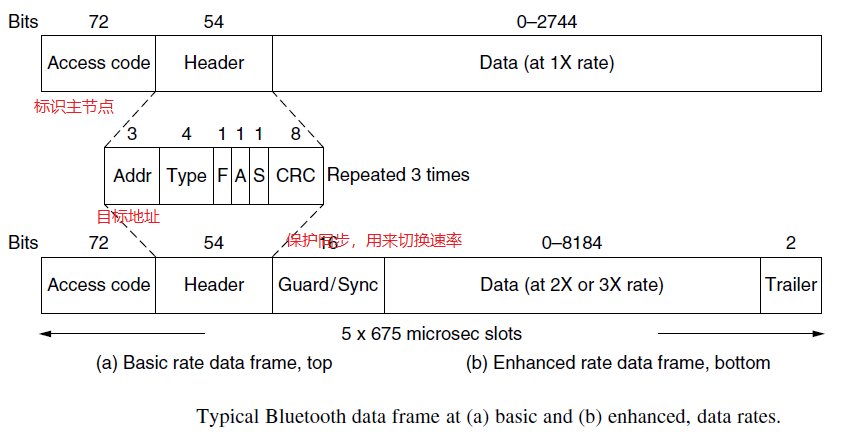

* F：Flow标志，从节点表示缓冲区是否已满
* A：Acknowledgment确认标志
* A：Sequence，采用停等控制机制，一位即可

## 4.7 RFID

* 4.7.1 EPC Gen 2 Architecture
* 4.7.2 EPC Gen 2 Physical Layer
* 4.7.3 EPC Gen 2 Tag Identification Layer
* 4.7.4 Tag Identification Message Formats

## RFID与EPC

* 电子产品码:EPC, Electronic Product Code，研究始于1999年美国MIT的Auto-ID中心，是条形码的替代品
* EPCGlobal成立于2003,商品化由Auto-ID中心开发的RFID技术
* 分为两种:-被动RFID;-主动RFID
* EPC代码+RFID+Internet=EPC系统，应用于物联网

EPC系统是一个复杂、全面、综合的系统，包括RFID、EPC编码、网络、通信协议等，RFID只是其中的一个组成部分。EPC是RFID技术的应用领域之一，只有特定的低成本的RFID标签才适合EPC系统。

## 4.7.1 EPC Gen 2 Architecture

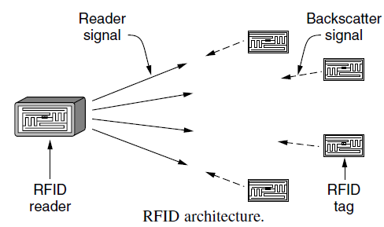

RFID Tag:有唯一的96位EPC识别码和少量内存,内存信息可由RFID读写器读取和写入。

## 4.7.2 EPC Gen 2 Physical Layer

* UHF：902-928MHz
* 采用幅移键控调制进行编码
* 后向反射（backscatter）: tag反射微弱信号
* 标签只能以低速率给读写器发送比特，不能接收或侦听其他标签的传输

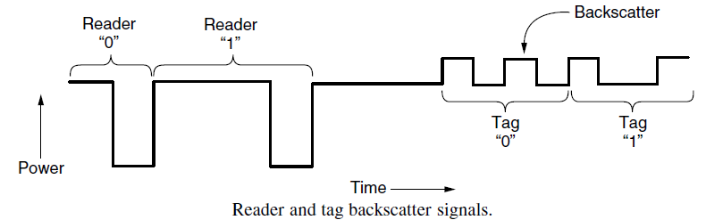

## 4.7.3 EPC Gen 2 Tag Identification Layer

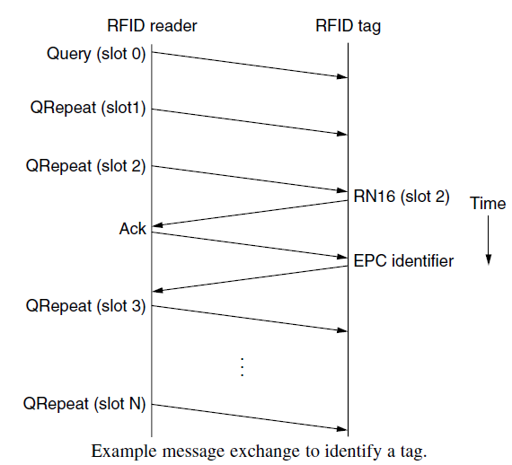

* 读写器发送Query(查询)启动标识，每个QRepeat前进到下一个时间槽
* 标签在标签时间槽范围内随机传输
* 标签第二次应答才发送标签。第一次只发送一个简短的随机数，以获得时间槽。
* 关键技术是tag间的冲突避免。

## 4.7.4 Tag Identification Message Formats

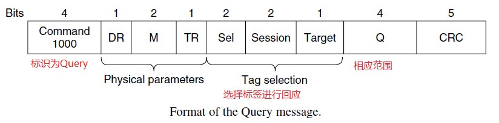

## 4.8 数据链路层交换

* 4.8.1 Uses of Bridges
* 4.8.2 Learning Bridges
* 4.8.3 Spanning Tree Bridges
* 4.8.4 Repeaters, Hubs, Bridges, Switches, Routers, and Gateways
* 4.8.5 Virtual LANs

## 4.8.1 Uses of Bridges

* 网桥（bridge）是工作在数据链路层的一种网络互连设备，它在互连的LAN之间实现帧的存储和转发。
* 为什么使用桥？

–学校和企业的各个部门分别拥有自己独立管理的LAN，为了进行交互，需要使用桥来实现互连
–一个组织可能地理上分布在不同建筑物内，在每个建筑物内组建单独的LAN，并使用桥将这些LAN连接起来，是比较经济的方案
–将一个负载很重的大LAN分隔成使用网桥互连的几个LAN可减轻负担

## 4.8.2 Learning Bridges

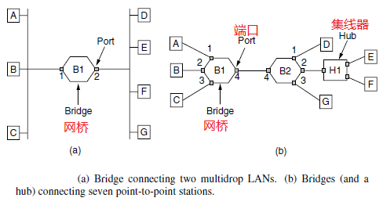

* 工作原理：

* –网桥工作在混杂（promiscuous）方式，接收所有的帧
* –网桥接收到一帧后，通过查询地址/端口对应表(harsh table)来确定是丢弃还是转发
* –网桥刚启动时，地址/端口对应表为空，采用泛洪（flooding）算法转发帧
* –在转发过程中采用逆向学习（backward learning）算法收集MAC地址。网桥通过分析帧的源MAC地址得到MAC地址与端口的对应关系，并写入地址/端口对应表

## 网桥应当按照以下自学习算法处理收到的帧和建立转发表

* 若从A 发出的帧从接口x 进入了某网桥，那么从这个接口出发沿相反方向一定可把一个帧传送到A。
* 网桥每收到一个帧，就记下其源地址和进入网桥的接口，作为转发表中的一个项目。
* 在建立转发表时是把帧首部中的源地址写在“地址”这一栏的下面。
* 在转发帧时，则是根据收到的帧首部中的目的地址来转发的。这时就把在“地址”栏下面已经记下的源地址当作目标地址，而把记下的进入接口当作转发接口。

## 转发表举例

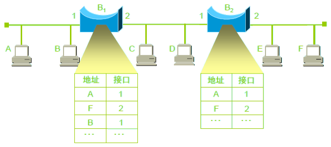

## 网桥在转发表中登记以下三个信息

* 在网桥的转发表中写入的信息除了地址和接口外，还有帧进入该网桥的时间。
* 这是因为以太网的拓扑可能经常会发生变化，站点也可能会更换适配器（这就改变了站点的地址）。另外，以太网上的工作站并非总是接通电源的。
* 把每个帧到达网桥的时间登记下来，就可以在转发表中只保留网络拓扑的最新状态信息。这样就使得网桥中的转发表能反映当前网络的最新拓扑状态。

## 网桥的自学习和转发帧的步骤归纳

* 网桥收到一帧后先进行自学习。查找转发表中与收到帧的源地址有无相匹配的项目。如没有，就在转发表中增加一个项目（源地址、进入的接口和时间）。如有，则把原有的项目进行更新。网桥并定时检查，删除在一段时间内没有更新的地址/端口项
* 转发帧。查找转发表中与收到帧的目的地址有无相匹配的项目。

–如没有，则通过所有其他接口（但进入网桥的接口除外）进行转发。
–如有，则按转发表中给出的接口进行转发。
–若转发表中给出的接口就是该帧进入网桥的接口，则应丢弃这个帧（因为这时不需要经过网桥进行转发）。

## 网桥上的协议处理

* 网桥是链路层设备
* 在网桥中，帧从物理层上传给MAC层，把帧传递到中继，传递给通往目标的端口的MAC层，然后帧继续传播
* 在中继可重写该层的头

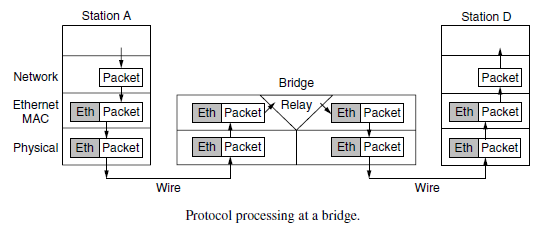

## 4.8.3 Spanning Tree Bridges

多个网桥之间可使用冗余链路并可能产生回路

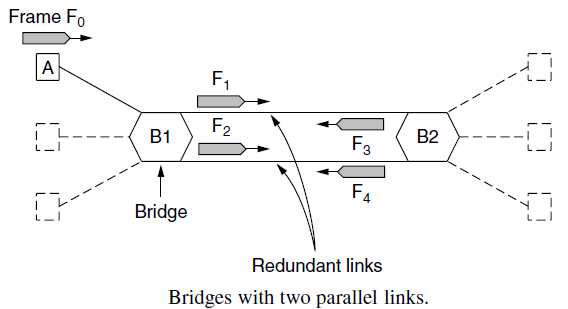

## 解决多个网桥产生回路的方法

让网桥之间互相通信，用一棵到达每个网桥的生成树（Spanning Tree）覆盖实际的拓扑结构。

## 构造生成树

* 每个网桥广播自己的标识符（基于MAC地址），标识符最小的网桥为生成树的根。
* 每个网桥计算自己到根的最短路径，构造出生成树，使得每个LAN和桥到根的路径最短。用最低标识符打破平局。
* 生成树构造完后，算法在网络正常操作期间仍继续执行以便自动发现拓扑结构变化，更新生成树。

## 4.8.4Repeaters, Hubs, Bridges, Switches, Routers and Gateways中继器，集线器，网桥，交换机，路由器和网关

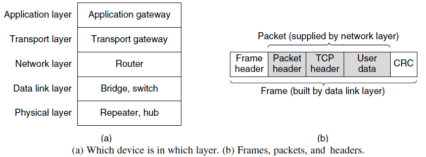

## Repeater 中继器

* 功能：对接收信号进行再生和发送

局域网发展初期，网络使用传输介质主要是同轴电缆，数字信号在同轴电缆中传输过程中存在衰减，并且波形会发生畸变；传输介质的长度与信号的衰减、信号的传输延迟相关。因此，在使用同轴电缆作为传输介质的局域网的物理层协议中，必须对单根同轴电缆的最大长度，以及接入的结点数加以限制；
中继器在早期的局域网组网中应用广泛。

* 中继器基本工作原理

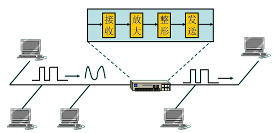

## 工作在物理层：

* 中继器只能起到对传输介质上信号波形的接收、放大、整形与转发的作用——物理层的功能；
* 中继器的工作不涉及帧的结构，不对帧的内容作任何处理。只能起到增加传输介质长度的作用。

所有连接在不同缆段上的多个结点，只要有一个发送数据，所有的结点都可以接收到，所以由中继器连接的几个网段仍然属于一个局域网。

## Hub 集线器

早期Ethernet组网中主要使用了粗同轴电缆的10BASE-5与细同轴电缆的10BASE-2协议，使用中继器较多；随着10BASE-T协议的出现，使用非屏蔽双绞线就可以实现10Mb/s的数据信号传输，这一技术大大推进了Ethernet的广泛应用；在使用10BASE-T协议组网时，集线器作用很重要。
所有结点通过双绞线连接到一个集线器上，仍然执行CSMA/CD介质访问控制方法，当一个结点发送数据时，所有的结点都能够接收到，所以工作在物理层。

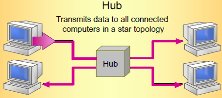

## Bridge网桥

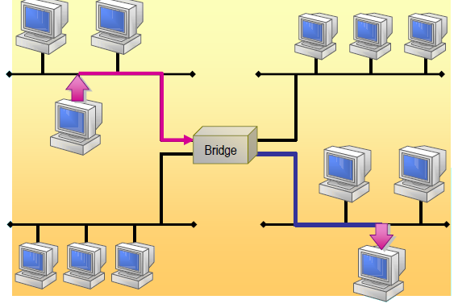

## Switches交换机

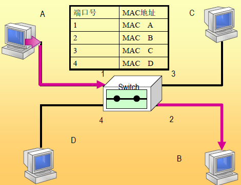

## MAC层的硬件地址

* 在局域网中，硬件地址又称为物理地址，或MAC 地址。
* IEEE 的注册管理机构RA 负责向厂家分配地址字段的前三个字节(即高位24 位)。
* 地址字段中的后三个字节(即低位24 位)由厂家自行指派，称为扩展标识符，必须保证生产出的适配器没有重复地址。
* 一个地址块可以生成224个不同的地址。这种48 位地址称为MAC-48，它的通用名称是EUI-48。
* “MAC地址”实际上就是适配器地址或适配器标识符EUI-48。

## Routers 路由器

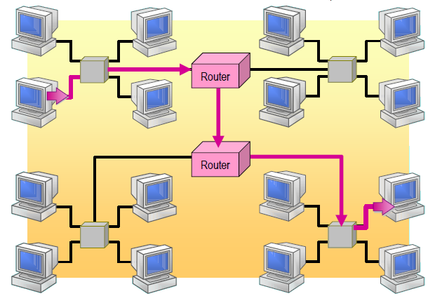

## 虚拟局域网

* 虚拟局域网VLAN是由一些局域网网段构成的与物理位置无关的逻辑组。

–这些网段具有某些共同的需求。
–每一个VLAN的帧都有一个明确的标识符，指明发送这个帧的工作站是属于哪一个VLAN。

* 虚拟局域网其实只是局域网给用户提供的一种服务，而并不是一种新型局域网。

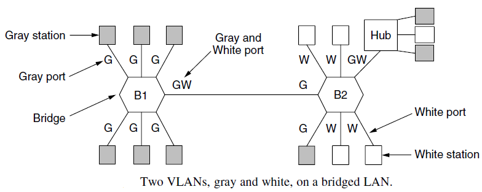

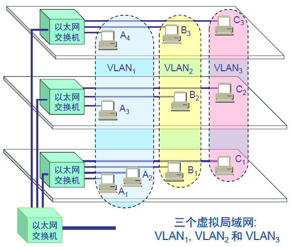

* 当B1 向VLAN2 工作组内成员发送数据时，工作站B2 和B3 将会收到广播的信息
* B1 发送数据时，工作站A1, A2 和C1都不会收到B1 发出的广播信息
* 虚拟局域网限制了接收广播信息的工作站数，使得网络不会因传播过多的广播信息(即“广播风暴”)而引起性能恶化

## 虚拟局域网使用的以太网帧格式

虚拟局域网协议允许在以太网的帧格式中插入一个4字节的标识符，称为VLAN标识符(identifier)，用来指明发送该帧的工作站属于哪一个虚拟局域网。

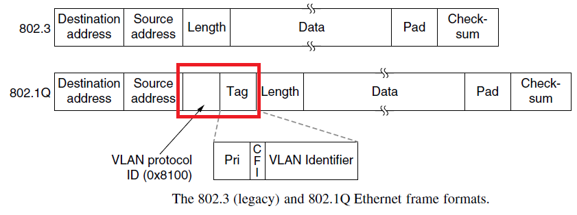
