* Copyright(C)肖文栋教授@北京科技大学自动化学院

第五章网络层The Network Layer

## 内容安排

* 5.1 Network Layer Design Issues
* 5.2 Routing Algorithms
* 5.3 Congestion Control Algorithms
* 5.4 Quality of Service
* 5.5 Internetworking
* 5.6 The Network Layer in the Internet

# 5.1 Network Layer Design Issues

* 网络层要解决的关键问题是如何将源端数据包送到接收方。
* 网络层是处理端到端传输的最低层。
* 网络层须知道网络的拓扑结构，并选择路由。

## 5.1.1 Store-and-Forward Packet Switching存储转发数据包交换

Store-and-forward packet switching mechanism:

* A host with a packet to send transmits it to the nearest router.
* The packet is stored there until it has fully arrived and the link has finished its processing by verifying the checksum.
* Then it is forwarded to the next router along the path until it reaches the destination host, where it is delivered.

## 5.1.2 Services Provided to the Transport Layer提供给传输层的服务

The services should bedesigned with the following goals:

* 1.The services should be independent of the router technology.
* 2.The transport layer should be shielded (屏蔽) from the number, type, andtopology of the routers present.
* 3.The network addresses made available to the transport layer shoulduse a uniform numbering plan, even across LANs and WANs.

为传输层提供服务方式的争斗：

* 面向连接服务: 传统电信的观点：通信子网应该提供可靠的、面向连接的服务。
* 无连接服务: Internet的观点：通信子网无论怎么设计都是不可靠的，因此网络层只需提供无连接服务。

## 5.1.3 Implementation of Connectionless Service无连接服务的实现

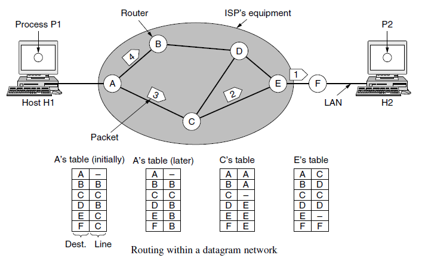

When packet 4 gets to A, A decided to send packet 4 via a different route than that of the first three packets. Perhaps it has learned of a traffic jam somewhere along the ACE path and updated its routing table,

## 5.1.4 Implementation of Connection-Oriented Service面向连接服务的实现

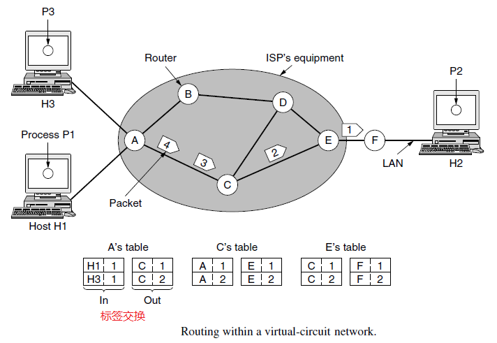

A assigns a differentconnection identifier to the outgoing traffic for the second connection.

## 5.1.5 Comparison of Virtual-Circuit & Datagram Networks虚电路与数据报网络的比较

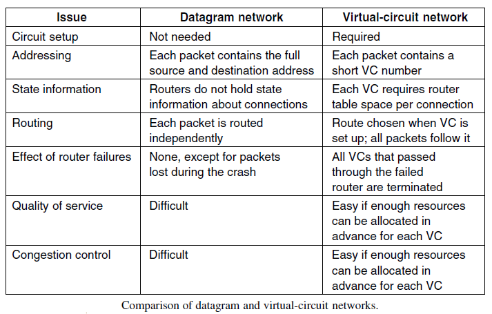

## 5.2 RoutingAlgorithms

* 5.2.1 The Optimality Principle
* 5.2.2 Shortest Path Algorithm
* 5.2.3 Flooding
* 5.2.4 Distance Vector Routing
* 5.2.5 Link State Routing
* 5.2.6 Hierarchical Routing
* 5.2.7 Broadcast Routing
* 5.2.8 Multicast Routing
* 5.2.9 Anycast Routing
* 5.2.10 Routing for Mobile Hosts
* 5.2.11 Routing in Ad Hoc Networks

## RoutingAlgorithms

* 路由算法是网络层软件的一部分

–子网采用数据报方式，每个包都要做路由选择；
–子网采用虚电路方式，只需在建立连接时做一次路由选择。

* 路由算法应具有的特性

–正确性（correctness）
–简单性（simplicity）
–健壮性（robustness）
–稳定性（stability）
–公平性（fairness）
–最优性（optimality）

* 路由算法分类

–非自适应算法，静态路由算法
–自适应算法，动态路由算法

Conflict between fairness and optimality.

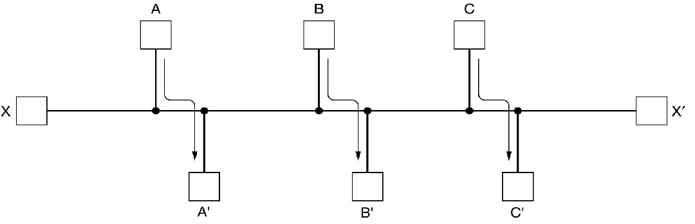

## 5.2.1优化原则

最优化原则（optimality principle）

* –如果路由器J 在路由器I 到K 的最优路由上，那么从J 到K 的最优路由会落在同一路由上。

汇集树（sink tree）

* –从所有的源结点到一个给定的目的结点的最优路由的集合形成了一个以目的结点为根的树，称为汇集树；
* –路由算法的目的是找出并使用汇集树。

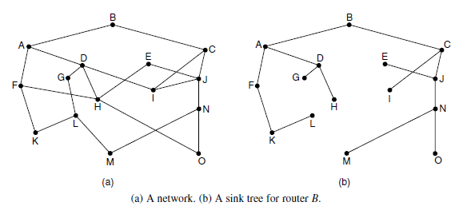

## 5.2.2最短路径路由算法Shortest Path Routing

基本思想

* –构建子网的拓扑图，图中的每个结点代表一个路由器，每条弧代表一条通信线路。为了选择两个路由器间的路由，算法在图中找出最短路径。

测量路径长度的方法

* –结点数量
* –地理距离
* –传输延迟
* –距离、信道带宽等参数的加权函数

## Dijkstra算法

* 1.每个结点用源结点沿已知最佳路径到本结点的距离来标注，标注分为临时性标注和永久性标注；
* 2.初始时，所有结点都为临时性标注，标注为无穷大；
* 3.将源结点标注为0，且为永久性标注，并令其为工作结点；
* 4.检查与工作结点相邻的临时性结点，若该结点到工作结点的距离与工作结点的标注之和小于该* 结点的标注，则用新计算得到的和重新标注该结点；
* 5.在整个图中查找具有最小值的临时性标注结点，将其变为永久性结点，并成为下一轮检查的工作结点；
* 6.重复第四、五步，直到目的结点成为工作结点

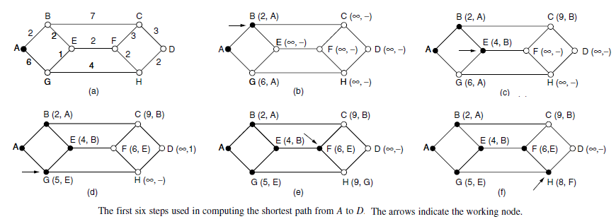

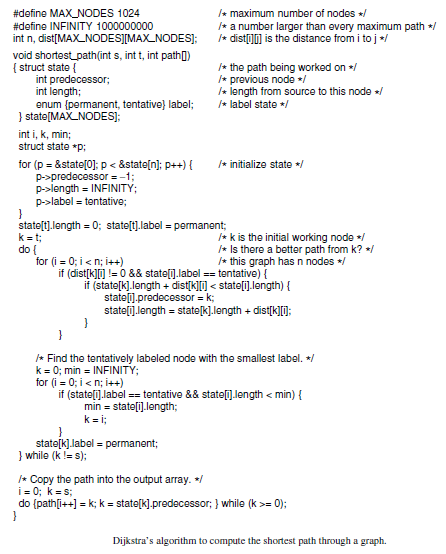

## 5.2.3 泛洪算法（Flooding）

基本思想

* – 把收到的每一个包，向除了该包到来的线路外的所有输出线路发送。

主要问题

* – 洪泛要产生大量重复包。

解决措施

* – 每个包头包含一个跳计数器，每经过一跳该计数器减1，为0时则丢弃该包；
* – 让路由器记录已经泛洪过的数据包, 避免再次发送。方法：每个源路由器为数据包定义一个序号，每个路由器记录序号，避免重发。

## 5.2.4 距离向量路由算法Distance Vector Routing

属于动态路由算法，也称分布式Bellman-Ford路由算法，最初用于ARPANET，也曾用于Internet, 相应的协议名为RIP协议。

基本思想:

* – 每个路由器维护一张表，表中给出了到每个目的地的已知最佳距离和线路，并通过与相邻路由器交换距离信息来更新表；
* – 每个路由器的路由表包括两部分：到达目的结点的最佳输出线路，和到达目的结点的距离估计值；
* – 每隔一段时间，路由器向所有邻居结点发送它到每个目的结点的路由表，同时它也接收每个邻居结点发来的路由表；
* – 邻居结点X发来的表中，X到路由器i的距离为Xi，本路由器到X的距离为m，则路由器经过X到i的距离为Xi + m。根据不同邻居发来的信息，计算Xi + m，并取最小值，更新本路由器的路由表；
* – 注意：本路由器中的老路由表在计算中不被使用

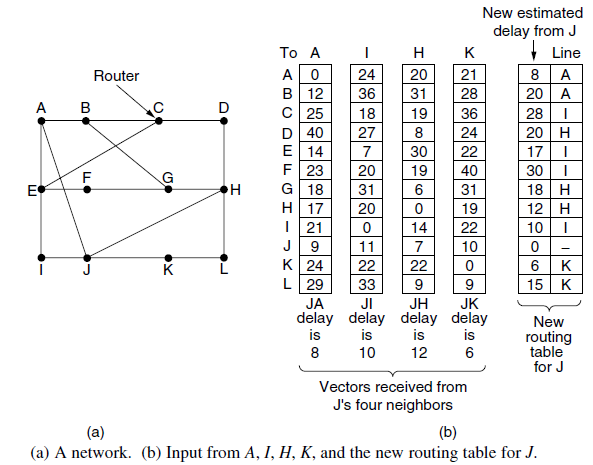

## 5.2.5 链路状态路由算法Link State Routing

距离向量路由算法的主要问题: 收敛速度慢

链路状态路由算法：

* 1. 发现邻居结点，并了解它们的网络地址；
* 2. 设置每个邻居结点的延迟或开销；
* 3. 构造一个包含所有获知的链路状态包；
* 4. 将这个包发送给所有其它路由器，并接收来自所有其它路由器的链路状态包；
* 5. 计算到每个其它路由器的最短路径。

Link State Routing：发现邻居

* 路由器启动后，通过发送HELLO包发现邻居结点；
* 两个或多个路由器连在一个LAN时，引入人工结点。

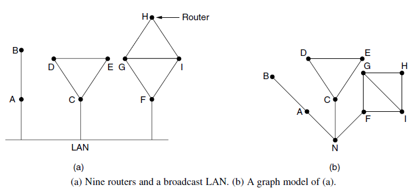

Link State Routing：设置链路成本

* 一种直接的方法是：发送一个要对方立即响应的ECHO包，来回时间除以2即为延迟

Link State Routing：构造链路状态包

* 包以发送方的标识符开头，后面是序号、年龄和一个邻居结点列表；
* 列表中对应每个邻居结点，都有发送方到它们的延迟或开销；
* 链路状态包定期创建或发生重大事件时创建

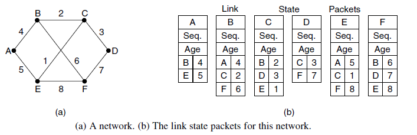

Link State Routing：分发链路状态包

* 基本思想：洪泛链路状态包，为控制洪泛，每个包包含一个序号，每次发送新包时加1。路由器记录信息对（源路由器，序号），当一个链路状态包到达时，若是新的，则分发；若是重复的，则丢弃；若序号比路由器记录中的最大序号小，则认为过时而丢弃；
* 改进
* 1.序号循环使用会混淆，解决办法：使用32位序号；
* 2.路由器崩溃后，序号重置；
* 3.序号出错；
* 4.链路状态包到达后，延迟一段时间，并与其它已到达的来自同一路由器的链路状态包比较序号，丢弃重复包，保留新包；
* 5.链路状态包需要应答；
* 第二、三问题的解决办法：增加年龄（age）域，每秒钟年龄减1，为零则丢弃。

* 从E发来的链路状态包有两个，一个经过EAB，另一个经过EFB；
* 从D发来的链路状态包有两个，一个经过DCB，另一个经过DFB；

## Link State Routing：计算新路由

根据Dijkstra算法计算最短路径
应用：
–IS-IS，中间系统到中间系统链路状态协议，用于ISP的IP协议中
–OSPF，开放最短路径优先协议，广泛应用于公司网络

## 5.2.6 分层路由（Hierarchical Routing）

网络规模增长带来的问题

* –路由器中的路由表增大；
* –路由器为选择路由而占用的内存、CPU时间和网络带宽增大。

分层路由

* –分而治之的思想；
* –根据需要，将路由器分成区域（regions）、聚类（clusters）、区（zones）和组（groups）…

分层路由带来的问题

* –路由表中的路由不一定是最优路由。

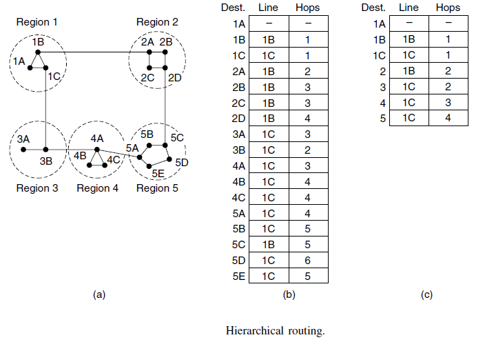

## 5.2.7 广播路由Broadcast Routing

* 泛洪（flooding）
* RPF (Reverse Path Forwarding, 反向路径转发)

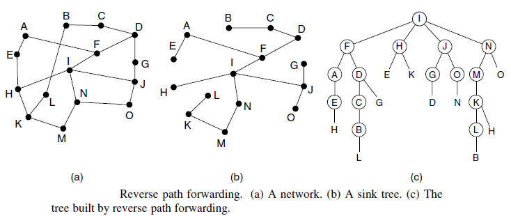

* 如广播数据包是沿着最佳路径被转发过来的，则路由器将其转发到除了到达的那条线路之外所有其它的接口上；
* 分组在何种情形下被丢弃？不在反向路径上

## 5.2.8 组播路由Multicasting Routing

* 泛洪（flooding）
* 通过修剪广播生成树得到组播生成树

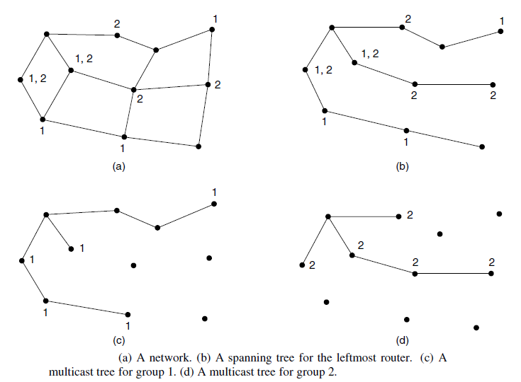

* 基于核心树的组播方法：组播源使用同一棵共享树，非最优，但节省存储、消息发送和计算。

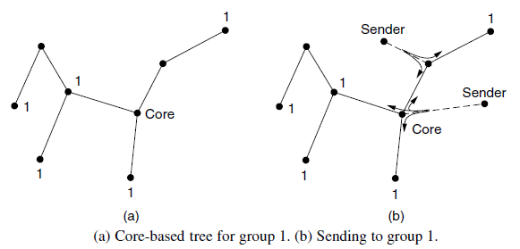

## 5.2.9 选播路由Anycast Routing

* 数据包被传给最近的一个组成员。
* Distance vector及Link state路由算法均可用。

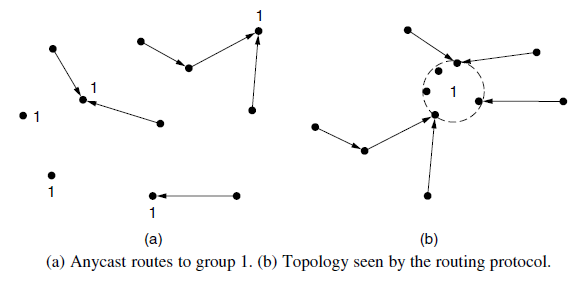

## 5.2.10移动主机的路由

为了能够将数据包转发给移动主机，网络必须首先要找到移动的主机
一些基本概念

* –移动主机（mobile hosts）：包括位置发生变化，通过固定方式或移动方式与网络连接的两类用户；
* –家乡位置（home location）：所有用户都有一个永久的家乡位置，用一个地址（home address）来标识；
* –家乡代理（home agent）：每个区域有一个家乡代理，负责记录家乡在该区域，但是目前正在访问其它区域的用户。
* –转交地址（care of address）:本地地址

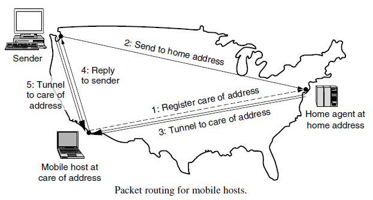

移动用户的路由转发过程

* –当一个包发给移动用户时，首先被转发到用户的家乡局域网；
* –该包到达用户的家乡局域网后，被家乡代理接收，家乡代理查询移动用户的新位置和与其对应的外部代理的地址；
* –家乡代理采用隧道技术，将收到的包作为净荷封装到一个新包中，发给转交地址；
* –家乡代理告诉发送方，发给移动用户的后续包作为净荷封装成包直接发给转交地址；

## 5.2.11 Routing in Ad Hoc Networks

Possibilities when the routers are mobile:

* Military vehicles on battlefield.–No infrastructure.
* A fleet of ships at sea.–All moving all the time
* Emergency works at earthquake .–The infrastructure destroyed.
* A gathering of people with notebook computers.–In an area lacking 802.11.

## MANET: Mobile Ad Hoc Network

Why Routing in MANET?

* Host mobility

–link failure/repair due to mobility may have different characteristics than those due to other causes

* Rate of link failure/repair may be high when nodes move fast
* New performance criteria may be used

–route stability despite mobility
–energy consumption

## Routing Protocols

* Many protocols have been proposed
* Some have been invented specifically for MANET
* Others are adapted from previously proposed protocols for wired networks
* No single protocol works well in all environments–some attempts made to develop adaptive protocols
* Proactive protocols

–Maintain routes between every host pair at all times
–Based on periodic updates; High routing overhead
–Example: DSDV (destination sequenced distance vector), OLSR, TBRPF

* Reactive protocols

–Determine route if and when needed
–Source initiates route discovery
–Example: AODV, DSR (dynamic source routing)

* Hybrid protocols

–Adaptive; Combination of proactive and reactive
–Example : ZRP (zone routing protocol)
Proactively tracks topology & maintain routing table within routing zone
Reactively acquires routes to nodes beyond routing zone by querying between overlapping zones

* Hierarchical routing

–Clustering & hierarchical routing with multi-level hierarchy

## Protocol Trade-offs

* Proactive protocols

–Always maintain routes
–Little or no delay for route determination
–Consume bandwidth to keep routes up-to-date
–Maintain routes which may never be used

* Reactive protocols

–Lower overhead since routes are determined on demand
–Significant delay in route determination
–Employ flooding (global search)
–Control traffic may be bursty

* Which approach achieves a better trade-off depends on the traffic and mobility patterns

## Ad Hoc On-Demand Distance Vector Routing (AODV)

* AODV maintains routing tables at the nodes.
* AODV retains the desirable feature that routes are maintained only between nodes which need to communicate

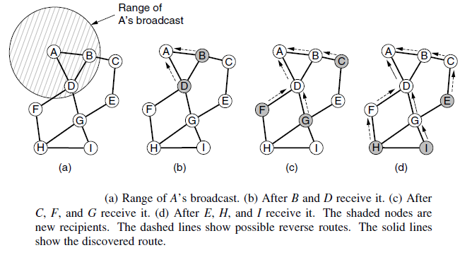

## Route Requests in AODV

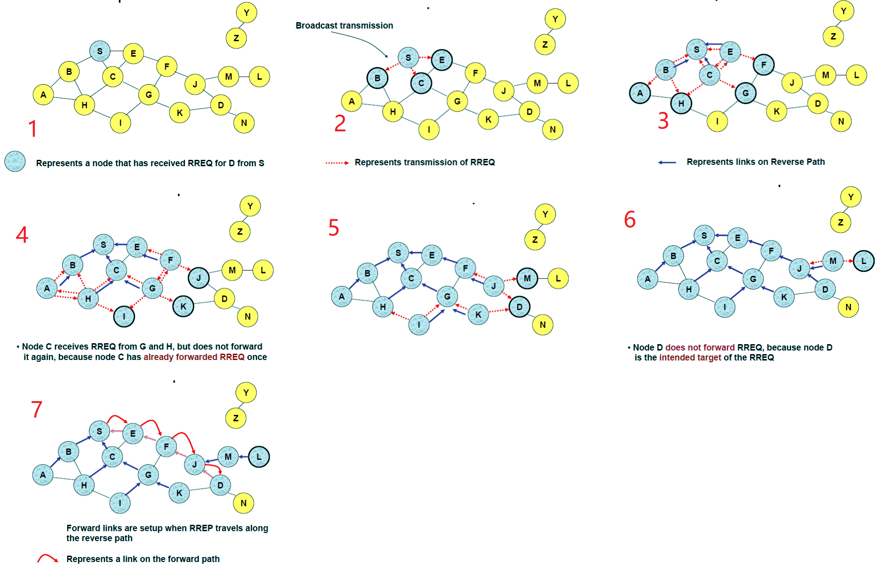

## Route Request and Route Reply

* Route Request (RREQ) includes the last known sequence numberfor the destination
* An intermediate node may also send a Route Reply (RREP) provided that it knows a more recent paththan the one previously known to sender
* Intermediate nodes that forward the RREP, also record the next hop to destination
* A routing table entry maintaining a reverse pathis purged after a timeout interval
* A routing table entry maintaining a forward pathis purged if not usedfor a active_route_timeoutinterval

## Link Failure

* A neighbor of node X is consideredactivefor a routing table entry if the neighbor sent a packet within active_route_timeoutinterval which was forwarded using that entry
* Neighboring nodes periodically exchangehellomessage
* When the next hop link in a routing table entry breaks, all activeneighbors are informed
* Link failures are propagated by means of Route Error (RERR)messages, which also update destination sequence numbers

## Route Error

* When node X is unable to forward packet P (from node S to node D) on link (X,Y), it generates a RERR message
* Node X increments the destination sequence number for D cached at node X
* The incremented sequence number Nis included in the RERR
* When node S receives the RERR, it initiates a new route discovery for D using destination sequence number at least as large as N
* When node D receives the route request with destination sequence number N, node D will set its sequence number to N, unless it is already larger than N

## AODV: Summary

* Routes need not be included in packet headers
* Nodes maintain routing tables containing entries only for routes that are in active use
* At most one next-hop per destination maintained at each node.–DSR may maintain several routes for a single destination
* Sequence numbers are used to avoid old/broken routes
* Sequence numbers prevent formation of routing loops
* Unused routes expire even if topology does not change

## Techniques to Deal with Scalability in MANETs

Flat structure: to avoid the expensive pure flooding

* –Multi-Point Relay (MPR) technique, used by OLSR,

link state dissemination and route table are implemented via MPR

* –Shortest Path Treetechnique, used by TBRPF,link state info is disseminated via shortest path tree, reverse path forwarding for data packet transmission
* –Connected Dominating Set (CDS) technique, Jie Wu’s method,link state dissemination and route table are implemented via CDS
* –Hazy sighted link state (HSLS) technique, update localized regions more frequently

Hybrid Structure:

* –ZRP: locally proactive, globally reactive

Hierarchical Structure: cluster-based, with cluster headers or gateways

* –Hierarchical link state (HierLS) routing
* –Hierarchical state routing (HSR) by UCLA, distance vector approach
* –Landmark Routing (LANMAR) by UCLA

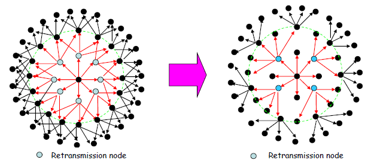

# 5.3 Congestion Control Algorithms拥塞控制算法

* 5.3.1 Approaches to Congestion Control拥塞控制途径
* 5.3.2 Traffic-Aware Routing流量感知路由
* 5.3.3 Admission Control准入控制
* 5.3.4 Traffic Throttling流量调节
* 5.3.5 Load Shedding负载脱落

## 5.3 Congestion Control Algorithms拥塞控制算法

拥塞（congestion）
-网络中存在太多的数据包导致数据包被延迟及丢失，性能会下降，这种情况称为拥塞。
拥塞产生的原因
-多个输入对应一个输出；
-慢速处理器；
-低带宽线路。

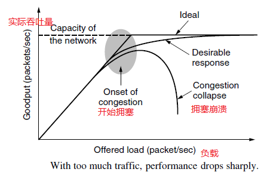

拥塞崩溃时网络性能骤降,数据包在网络内部遭遇足够的延迟,离开后已经不再有用

## 拥塞控制与流量控制的差异

* 拥塞控制（congestion control）需要确保通信子网能够承载用户提交的通信量，是一个全局性问题，涉及主机、路由器等很多因素；
* 流量控制（flow control）与点到点的通信量有关，主要解决快速发送方与慢速接收方的问题，是局部问题，一般都是基于反馈进行控制的。

## 5.3.1 Approaches to Congestion Control拥塞控制途径

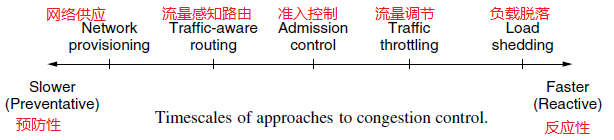

## 5.3.2 Traffic-Aware Routing流量感知路由

* To shift traffic away from hotspots that will bethe first places in the network to experience congestion
* The most direct way is to set the link weight to be a function of the(fixed) link bandwidth and propagation delay plus the (variable) measured load oraverage queuing delay. 但常会产生路由振荡
* 通常不依赖于负载来调整路由，相反往往通过multipath或在路由协议外部通过慢慢改变来调整路由。

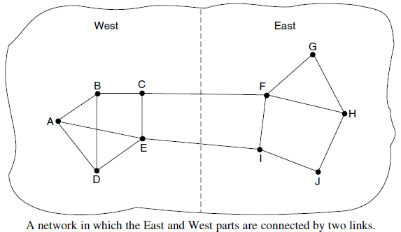

## 5.3.2 Admission Control准入控制

* 基本思想：除非网络可以容纳额外的流量而不会变得拥塞，否则不会建立新的虚电路。
* 要采用准入控制，必须归纳出虚电路的一些流量特性，往往用速度与形状表示。
* 基于流量说明，网络即能决定是否接受新的虚电路。
* 准入控制可以和流量感知结合在一起，在虚电路建立过程中，避开流量热点区域。

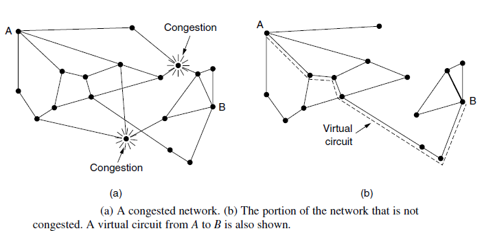

## 5.3.3 Traffic Throttling流量调节

* 基本想法：发送方调整传输速度以便发送网络能实际传送的流量，避免拥塞。
* 路由器必须确定何时网络快要接近拥塞，最好在发生拥塞之前就能确定。为此，每个路由器需连续监测它正在使用的资源，如输出线路的利用率、路由器内缓冲的队列（最有用）、因没有缓冲而丢失的数据包。
* 路由器必须及时把反馈信息传递给造成拥塞的发送方。
* 缓解拥塞需要发送方采取行动。

## 抑制包（Choke Packets）

* 路由器监控输出线路及其它资源的利用情况，超过某个阈值，则此资源进入警戒状态；
* 每个新包到来，检查它的输出线路是否处于警戒状态；
* 若是，则向源主机发送抑制包，包中指出发生拥塞的目的地址。同时将原包打上标记，正常转发；
* 源主机收到抑制包后，按一定比例减少发向特定目的地的流量。

显式拥塞通知:发生拥塞的路由器可在转发的数据包上打上标记，接收方收到后在发送应答时顺便通知发送方。

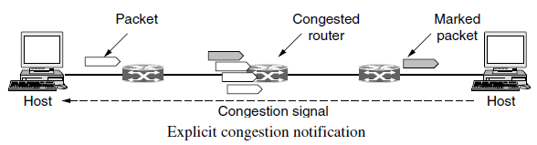

## 逐跳后压（Hop-by-Hop Backpressure）

* 在高速、长距离的网络中，由于源主机响应太慢，抑制包算法对拥塞控制的效果并不好，可采用逐跳抑制包算法；
* 基本思想：–抑制包对它经过的每一跳都发挥作用；–能够迅速缓解发生拥塞处的拥塞；–上游路由器要求有更多的缓冲区；

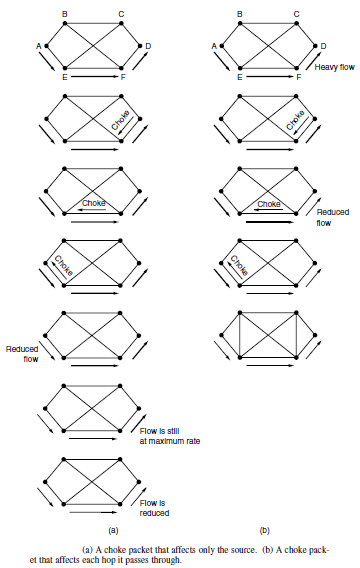

## 5.3.5 Load Shedding负载脱落

上述算法都不能消除拥塞时，路由器只得将包丢弃；
针对不同服务，可采取不同丢弃策略
-葡萄酒策略（wine）：旧分组比新分组更有价值，如文件传输
-牛奶策略（milk）：新分组比旧分组重要的多，如多媒体传输；

随机早期检测（RED，Random Early Detection）:
早期丢弃包，会减少拥塞发生的概率，提高网络性能。
当某条链路上的平均队列长度超过某个阈值时，则被认为即将拥塞并随机丢弃一小部分数据包

# 5.4 Quality of Service服务质量

5.4.1 Application Requirements应用需求
5.4.2 Traffic Shaping流量整形
5.4.3 Packet Scheduling包调度
5.4.4 Admission Control准入控制
5.4.5 Integrated Services综合服务
5.4.6 Differentiated Services区分服务

一些应用对网络的性能保障有很强的需求，如多媒体应用往往需要具备最小吞吐量与最大延迟的条件下才能正常工作。
保证QoS必须解决4个问题:
1.What applications need from the network.
2.How to regulate the traffic that enters the network.
3.How to reserve resources at routers to guarantee performance.
4.Whether the network can safely accept more traffic.

## 5.4.1 Application Requirements应用需求

每个流的QoS需求可以用四个主要参数来表示：带宽、延迟、抖动和丢失

## 5.4.2 Traffic Shaping流量整形

网络中的流量通常是突发性的，难以处理，可以填满缓冲区并导致数据包丢失。
流量整形是为了调节进入网络的数据流的平均速度和突发性所采用的技术。

流量整形：漏桶和令牌桶

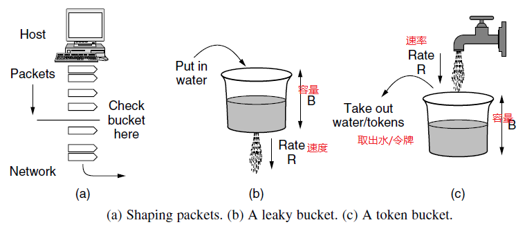

漏桶算法：将用户发出的不平滑的数据包流转变成网络中平滑的数据包流。
令牌桶算法：漏桶中存放令牌，包传输之前必须从桶中获得令牌，筒内只可累积固定数目的令牌。如果桶是空的必须等待令牌到达才能发送一个数据包。

## 5.4.3 Packet Scheduling包调度

同一个流的数据包之间以及在竞争流之间分配路由器资源的算法称为包调度算法。
包调度的具体做法是确定下一次把缓冲区中的哪些数据包发送到输出线路。
最直接的算法为FIFO, 尾丢包，无法提供良好的QoS, 一个包很容易影响到其它流的性能（饿死其它流量）

* 公平队列算法（fair queueing）

路由器的每个输出线路有多个队列；
路由器循环扫描各个队列，发送队头的包；
所有主机具有相同优先级.

缺点：给使用大数据包的主机提供了更多的带宽

* 加权公平队列算法（weighted fair queueing）

计算每个数据包发送完毕所需要的虚拟时间。
按照数据包的结束时间顺序排队，并按该顺序真正发送数据包。
其中，给不同主机以不同的优先级, 优先级高的主机发送的更快，从而可获得更多的机会。

## 5.4.4 Admission Control准入控制

用户向网络提供一个有QoS需求的流量
网络根据自己的容量及向其它流做出的承诺决定是否接受或拒绝该流
如接受，网络要提前在路由器上预留容量以保留新流发送时的服务质量
沿着数据包经过路由，沿途每个路由器都要预留相应的资源

* 接受或拒绝流不是一件简单的事情, 如：

某些应用程序更能容忍偶尔错过的最后期限，硬保证与软保证
某些应用程序可能愿意就流的参数讨价还价
需要用流规范(flow specification)来描述流

## 5.4.5 Integrated Services综合服务

综合服务主要针对单播与组播，设计流式多媒体的体系结构
此处重点关注组播，因单播是组播的特例

* RSVP-The ReSerVation Protocol资源预留协议

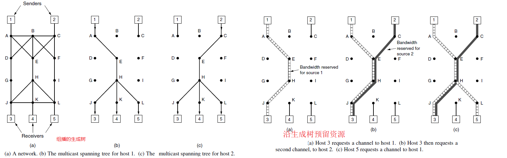

## 5.4.6 Differentiated Services区分服务

IntServ的缺欠：

* 需要为每个流进行预先设置。当流数量很大时，不能很好地扩展
* 在路由器中为每个流保留内部状态很容易导致路由器崩溃
* 设置中代码量大，并涉及到复杂的路由器-路由器之间的信息交换。

DiffServ的提出：

* 由每个路由器本地实现，无须事先设置流，也不牵涉整条路径
* 定义了一组服务类别，每个服务类别对应于特定的转发规则
* 客户数据包中需标上其所属的服务
* 服务类别定义为单跳行为（Per Hop Behaviour），对应于在每个路由器上得到的待遇

加速转发
服务类别分为两种：常规的和加速的

* 加速类别的数据包(如VoIP)可直接通过网络，好像不存在其它数据包，能获得低丢失、低延迟和低抖动的服务
* 加速转发的数据包将获得优惠待遇

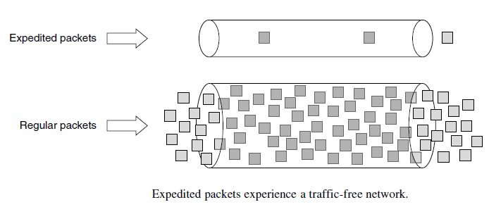

# 5.5Internetworking

5.5.1 How Networks Differ
5.5.2 How Networks can be Connected, 5.5.3 Tunneling
5.5.4 Internetwork Routing
5.5.5 Packet Fragmentation

* Many different networks exist, includingPANs, LANs, MANs, and WANs.
* Numerousprotocols are in widespread use across these networks in every layer
* 讨论网络互联, 即两个或多个网络的连接

## 5.5.1 How Networks Differ

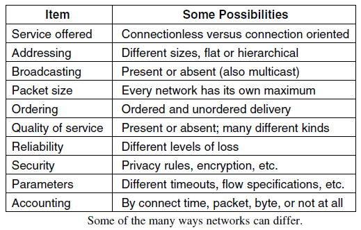

## 5.5.2 How Networks can be Connected

1.将每种网络的数据包翻译或转换成其它类别的数据包
2.在不同的网络上面构造一个公共层

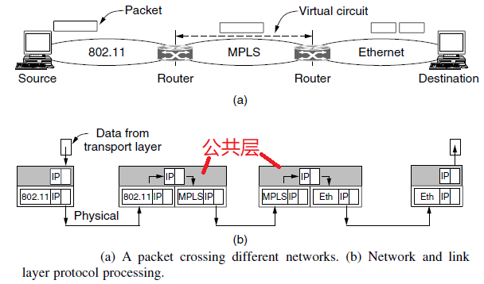

## 5.5.3 Tunneling隧道技术

源和目的主机所在网络类型相同，连接它们的是一个不同类型的网络，这种情况下可以采用隧道技术。

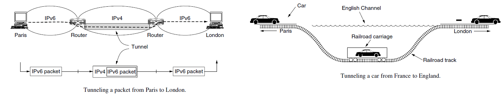

## 5.5.4 Internetwork Routing

两级路由算法：
域内或内部网关协议
域间或外部网关协议。在Internet上称为边界网关协议（BGP）

## 5.5.5 Packet Fragmentation

每个网络或链路均限制其数据包的最大长度，原因：

* 1.Hardware (e.g., the size of an Ethernet frame).
* 2.Operating system (e.g., all buffers are 512 bytes).
* 3.Protocols (e.g., the number of bits in the packet length field).
* 4.Compliance with some (inter)national standard.
* 5.Desire to reduce error-inducedretransmissions to some level.
* 6.Desire to prevent one packet from occupying the channel too long.

当一个大数据包要穿过一个最大数据包尺寸太小的网络时，网络互联问题就出现了

透明分段与非透明分段

* 透明分段：须知道何时收到所有的段，所有数据包必须经过同一路由器才能重组
* 非透明分段：路由器所做工作很少, 分段发送，只在目标点组合

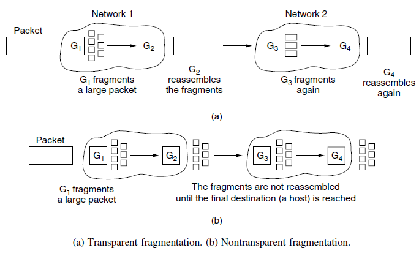

## IP中的非透明分段

给每个段一个数据包序号，一个数据包内的绝对字节偏移量和一个是否到达数据包末尾的标志位

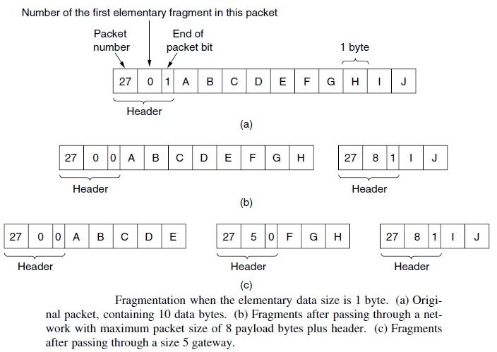

路径MTU发现

* 当一个路由器认为接收的数据包太大，它就生成一个报错数据包并发送给源端，并丢弃该包。
* 当源端收到报错数据包时重新将出错数据包分段。
* 如沿途遇到MTU更小的路由器, 则重复上述过程。
* 优点：源端可知道应发送多长的数据包。
* 缺点：可能增加发送数据包的启动延迟。

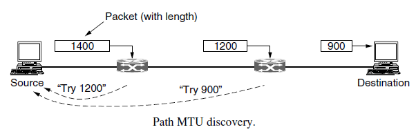

# 5.6 The Network Layer in the InternetInternet的网络层

5.6.1 The IP Version 4 Protocol
5.6.2 IP Addresses
5.6.3 IP Version 6
5.6.4 Internet Control Protocols
5.6.5 Label Switching and MPLS
5.6.6 OSPF—An Interior Gateway Routing Protocol
5.6.7 BGP—The Exterior Gateway Routing Protocol
5.6.8 Internet Multicasting
5.6.9 Mobile IP

在网络层，Internet可以看成是自治系统的集合，是由网络组成的网络。
将整个网络黏合在一起的正是Internet协议（IP，Internet Protocol）。

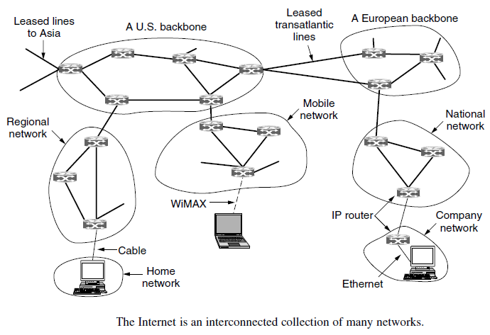

## 5.6.1 IPv4协议

每个IP数据报包含两部分：头+正文(IP头格式)

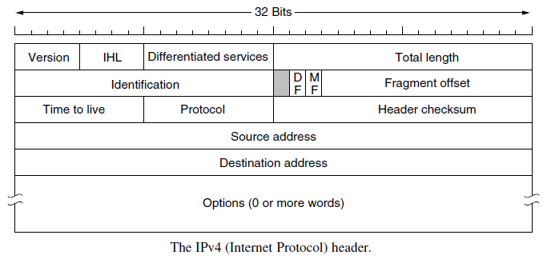

IP头包括20个字节的定长部分和可选的变长部分。传输从左到右，从上到下。
版本字段（version）；
IHL：IP包头长度，最小为5，最大为15，单位为32-bit word；

## 5.6.1 IPv4协议：IP头格式

区分服务（Differentiated services）字段
–前6位用来标记数据包的服务类型，
–后2位用来携带显式拥塞通知信息
总长度（Total length）字段，头和数据的总长度
标识（Identification）字段，数据报的标识
DF：Don’t Fragment；不分段标志位，不允许分割该数据报，用于发现路径MTU中。
MF：More Fragments，更多段标志位，除最后一个段外均需设置该位。
段偏移量（Fragment offset）
–除最后一个段外的所有段的长度必须是8字节（基本段长）的倍数。
生存期（Time to live）计数器
–设置为秒，最大为255秒。IP包每经过一个路由器TTL均递减，在一路由器排队时间较长时多倍递减。
协议域（Protocol）：上层为哪种传输协议，TCP、UDP、…
头校验和（Header checksum）
–只对IP包头做校验
源地址（Source address）和目的地址（Destination address）
选项（Options）
–变长，长度为4字节的倍数，不够则填充，最长为40字节；

## 5.6.2 IP Addresses

IPv4采用32位地址
一个地址指向一个网络端口
IP地址（IP Address）
–地址组成：网络号+ 主机号
–地址表示采用用点分隔的十进制表示法，如128.208.2.151
前缀：同一网络上相同的地址网络值
如前缀含28地址，24位用于网络部分，则写成128.208.0.0/24
子网掩码
-对应于IP地址中网络地址（网络号和子网号）的所有位置为“1”，对应于主机地址（主机号）的所有位置为“0”
-可与一IP地址进行AND操作，得到网络部分

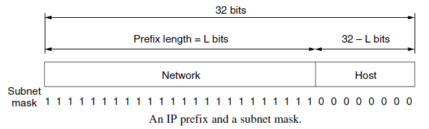

## 子网

在内部将一个网络块分成几个部分供多个内部网络使用，称子网划分
分割一个大型网络得到的一系列结果网络成为子网

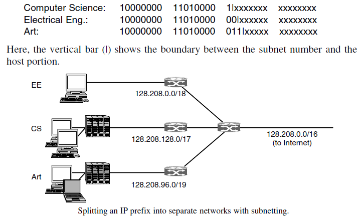

## 无类域间路由CIDR（Classless InterDomain Routing）

CIDR的提出
–Internet指数增长，IP地址即将用完，
–基于分类的IP地址空间的组织浪费了大量的地址
CIDR
–基本思想：可用路由聚合将多个小前缀的地址合并成一个大地址块，同样的一个IP地址，不同的路由器（因有不同的前缀信息）可对其进行不同的处理。

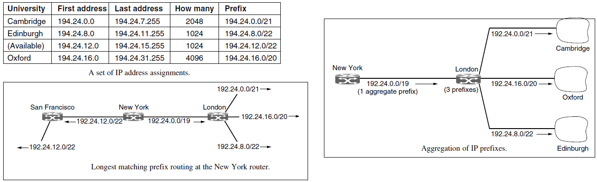

* 最长匹配前缀原则：路由查找时，若多个路由匹配成功，选择掩码长的路由（匹配的最具体的路由）方向.

## 分类和特殊寻址

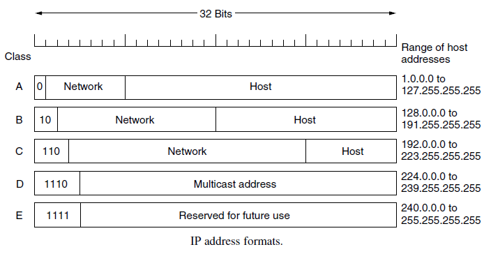

## A类IP地址

A类IP地址范围：1.0.0.0～127.255.255.255；
网络号长度：7位。从理论上A类可以有27=128个网络；
网络号为全0和全1（用十进制表示为0与127）的两个IP地址保留用于特殊目的，实际有126个不同的A类网络；
由于主机号长度为24位，因此每个A类网络的主机IP数理论上为224=16,777,216个；
主机号为全0和全1的两个IP地址保留用于特殊目的，故A类网络实际允许连接16,777,214个主机；
A类IP地址结构适用于有大量主机的大型网络。
A类IP地址有效范围是：1.0.0.1—126.255.255.254。

## B类IP地址

B类IP地址范围：128.0.0.0～191.255.255.255；
由于网络IP长度为14位，因此允许有214=16384个不同的B类网络，实际允许连接16382个网络；
由于主机IP长度为16位，因此每个B类网络可以有216=65536个主机或路由器，实际一个B类IP地址允许连接65534个主机或路由器；
B类IP地址适用于一些国际性大公司与政府机构等中等规模的组织使用；
B类IP地址有效范围是：128.1.0.1—191.254.255.254。

## C类IP地址

C类IP地址范围：192.0.0.0～223.255.255.255；
网络号长度为21位，因此允许有221=2097152个不同的C类网络；
主机号长度为8位，每个C类网络的主机地址数最多为28=256个，实际允许连接254个主机或路由器；
C类IP地址适用于一些小公司与普通的研究机构；
C类IP地址有效范围是：192.0.1.1—223.255.254.254

## 特殊IP地址

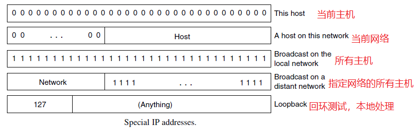

## 网络地址转换

基本思想：每个家庭或公司被分配给一个IP地址，用其传输Internet流量。客户网络内部流量，每台计算机有唯一的内部IP地址，但当数据包需要离开网络时应把唯一的内部IP地址转换成公共的IP地址。

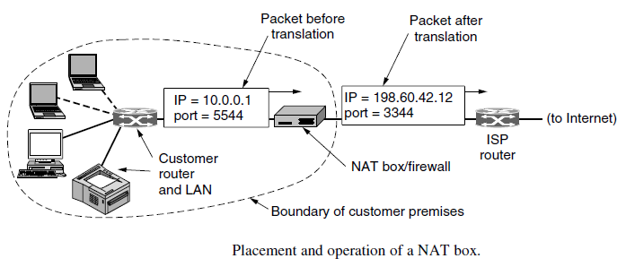

## 5.6.3 IPv6协议

IPv6的目标
-解决IPv4地址不足的灾难。
-即使在不能有效分配地址空间的情况下，也能支持数十亿的主机；
-减少路由表的大小；
-简化协议，使得路由器能够更快的处理包；
-提供比IPv4更好的安全性；
-更多的关注服务类型，特别是实时数据；
-支持Multicast；
-支持移动功能；
-协议具有很好的可扩展性；
-增强安全性
-在一段时间内，允许IPv4与IPv6共存。

## 与IPv4相比，IPv6的主要变化

* 地址变长，由32位变成128位；
* IP头简化，由13个字段减少为7个字段，提高路由器处理数据包的速度，提高吞吐量，缩短延迟
* 更好的支持选项功能；
* 安全性提高；
* 更注重服务类型。

## IPv6头

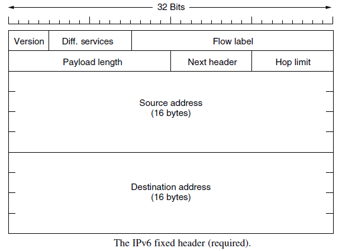

Version，值为6；
区分服务；
Flow label，用来允许源和目的建立一条具有特殊属性和需求的伪连接；
Payload length，用来指示IP包中40字节包头后面部分的长度，与IPv4的total length域不同；
Next header，指示扩展包头，若是最后一个包头，则指示传输协议类型（TCP/UDP）；
Hop limit，IP包的生存时间；
Source address，destination address，16字节定长地址

## IPv6地址表示

16字节地址表示成用冒号（:）隔开的8组，每组4个16进制位，例如
8000:0000:0000:0000:0123:4567:89AB:CDEF
由于有很多“0”，有三种优化表示
–打头的“0”可以省略，0123可以写成123；
–一组或多组16个“0”可以被一对冒号替代，但是一对冒号只能出现一次。上面的地址可以表示成
8000::123: 4567:89AB:CDEF
–IPv4地址可以写成一对冒号和用“.”分隔的十进制数，例如
::192.31.20.46

## IPv6扩展包头

–目前定义了六种类型的扩展包头
–hop-by-hop header，用来指示路径上所有路由器必须检查的信息；
–routing header，列出路径上必须要经过的路由器，
–fragmentation header，与IPv4相似，扩展头中包括IP包标识号、分段号和判断是否还有分段的位，只有源主机可以分段；

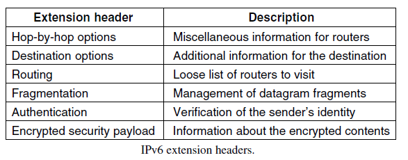

## IPv6头比IPv4头省掉了什么？

IP头简化，由13个字段减少为8个字段：
–IHL没有了，因IPv6有固定长度的头（40字节）
–协议（protocol）字段被拿掉了，因Next header已指明了最后IP头后面跟的是什么（如是TCP段还是UDP段）
–所有与分段有关的字段都去掉了，因其采用了另一种方式来分段（路径MTU发现）
–校验和字段也去掉了，因数据链路层与传输层通常有自己的校验和，快速、灵活

## 5.6.4 Internet Control Protocols

因特网控制协议是用于网络层的控制协议，主要包括：
IP协议——用于数据传输；
ICMP协议——因特网控制消息协议；Internet Control Message Protocol
ARP协议——地址解析协议；
DHCP协议----动态地址分配

## ICMP因特网控制消息协议

用来向数据包源端报告出错和Internet测试；
ICMP报文封装在IP包中。

## 地址解析协议ARP（The Address Resolution Protocol）

解决网络层地址（IP地址）与数据链路层地址（MAC地址）的映射问题；
方法：
–在系统中设置配置文件，给出IP地址与MAC地址的映射关系；
–更好(简单)的解决办法是发送广播包，目的主机收到后给出应答；该请求与应答所使用的协议为ARP
–优化处理：缓存（IP地址，MAC地址）映射，以备后用
–ARP表中的表项有生存期，超时则删除。

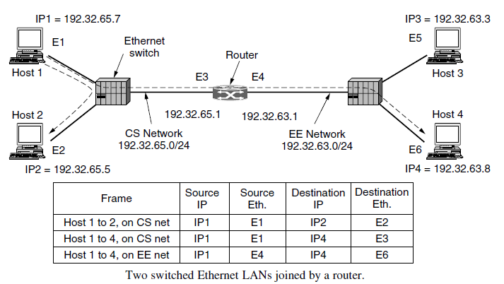

## 动态主机配置协议DHCP

每个网络必须有一个DHCP服务器负责地址配置
计算机广播报文，请求IP地址（DHCPdiscovery包）
DHCP服务器收到请求，为该计算机分配空闲地址，并通过DHCPoffer包返回主机。
服务器为每个分配的地址设定租赁时间，租赁期满前主机需续订。

## 5.6.5 Label Switching and MPLS标签交换与多协议标签交换

多用以网络之间移动Internet流量
MPLS在每个数据包前增加一个标签，路由器根据数据包标签而不是数据包目的地实施转发
标签时内部表的索引，快速查找该表能找到正确的输出线路

## 标签交换与MPLS

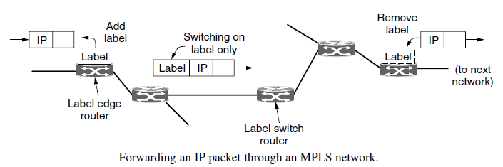

## 5.6.6 OSPF—An Interior Gateway Routing Protocol内部网关路由协议

开发协议的要求：
–开放，公开发表；
–支持多种距离衡量尺度，例如，物理距离、延迟等；
–动态算法；
–支持基于服务类型的路由；
–负载平衡；
–支持分层系统；
–适量的安全措施；
–支持隧道技术。

## 开放最短路径优先OSPF（Open Shortest Path First）

构造有向拓扑图
–根据实际的网络、路由器和线路构造有向图；
–每个弧赋一个开销值；
–两个路由器之间的线路用一对弧来表示，弧权可以不同；
–每个路由器用一个结点表示，网络结点与路由器结点的弧权为0
每个路由器用链路状态法计算自身到其他所有节点的最短路径
如有多条最短路径，则将流量分摊到这些路径上

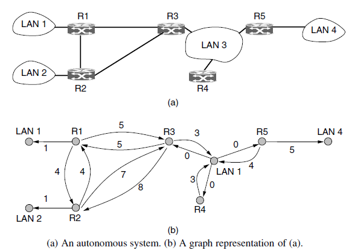

## OSPF分层路由

自治系统AS可以划分区域（areas）；
每个AS有一个主干（backbone）区域，称为区域0，所有区域与主干区域相连；
一般情况下，有三种路由
–区域内
–区域间
从源路由器到主干区域；
穿越主干区域到达目的区域；
到达目的路由器。
–自治系统间
四类路由器，允许重叠
–完全在一个区域内的内部路由器；
–连接多个区域的区域边界路由器；
–主干路由器；
–自治系统边界路由器。

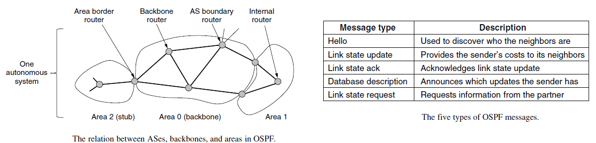

## 5.6.7 BGP—The Exterior Gateway Routing Protocol外部网关路由协议

Why different Intra-and Inter-AS routing ?
–Policy
--Inter-AS: admin wants control over how its traffic routed, who routes through its net. 政治因素
--Intra-AS: single admin, so no policy decisions needed
–Scale
--hierarchical routing saves table size, reduced update traffic
–Performance
--Intra-AS: can focus on performance
--Inter-AS: policy may dominate over performance

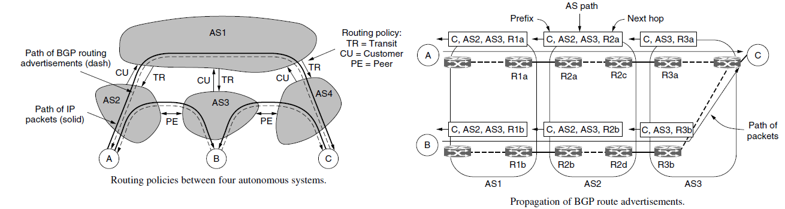

## 外部网关路由协议

–通过TCP连接传送路由信息；
–采用路径向量（path vector）算法，路由信息中记录路径的轨迹
---similar to Distance Vector protocol
---each Border Gateway broadcast to neighbors (peers) entire path(i.e, sequence of ASs) to destination
---E.g., Gateway X may send its path to dest. Z:
Path (X,Z) = X,Y1,Y2,Y3,…,Z

## 5.6.8 Internet Multicasting

D类IP地址用来组播
本地组播地址：

* 224.0.0.1 All systems on a LAN
* 224.0.0.2 All routers on a LAN
* 224.0.0.5 All OSPF routers on a LAN
* 224.0.0.251 All DNS servers on a LAN

组播算法可用来生成组播生成树

## 5.6.9 Mobile IP

支持当Internet用户离开家乡或路途过程中与Internet的连接,希望达到的目标:
1.Each mobile host must be able to use its home IP address anywhere.
2.Software changes to the fixed hosts were not permitted.
3.Changes to the router software and tables were not permitted.
4.Most packets for mobile hosts should not make detours(绕道) on the way.
5.No overhead(开销)should be incurred when a mobile host is at home.

解决方案:
Every site (网点)that wants to allow its users to roam(漫游) has to create a helper at the site called a home agent(家乡代理).
When a mobile host shows up at a foreign site, it obtains a new IP address (called a care-of address转交地址) at the foreign site.
The mobile then tells the home agent where it is now by giving it the care-of address.
When a packet for the mobile arrives at the home site and the mobile is elsewhere, the home agent grabs(截取) the packet and tunnels(隧道给) it to the mobile at the current care-of address.
The mobile can send reply packets directly to whoever it is communicating with, but still using its home address as the source address(源地址).

Mobile IP如何实现
The mobile IP solution for IPv4 is given in RFC 3344:
移动主机如何发现自己在移动?by ICMP router advertisement(通告)andsolicitation(恳求)messages.
-Mobiles listen for periodic router advertisements or send asolicitation to discover the nearest router
-If this router is not the usual address ofthe router when the mobile is at home, it must be on a foreign network.
如何得到转交地址care-of IP address:
-simply use DHCP.
-如IPv4地址短缺, 可通过foreign agent（外地代理）收发数据包.
The home agent (家乡代理)拦截发送给移动主机的数据包
-To send a packet to an IP host, the router will send an ARP query
-When the mobile is at home, it answers ARP queries for its IP address with its own address.
-When the mobile is away, the home agent responds to this query by giving its address. This is called a proxy ARP（ARP代理）.
家乡代理给移动主机发送数据包：建立隧道，通过隧道发送数据包给转交地址

仅为笔记，如有侵权请联系删除！
