《计算机网络》第六章：传输层（The Transport Layer）

* Copyright(C)肖文栋教授@北京科技大学自动化学院

## 内容概要

6 The Transport Layer
6.1 The Transport Service
6.2 Elements of Transport Protocols
6.3 Congestion Control
6.4 The Internet Transport Protocols: UDP
6.5 The Internet Transport Protocols: TCP
6.6 Performance Issues*
6.7 Delay-tolerant Networking*

# 6.1 The Transport Service

6.1.1 Services Provided to the Upper Layers
6.1.2 Transport Service Primitives
6.1.3 Berkeley Sockets
6.1.4 An Example of Socket Programming: An Internet File Server

# 6.1.1 Services Provided to the Upper Layers

* 引入传输层的原因

–消除网络层的不可靠性: 传输层运行在用户机器上,网络层代码主要运行在路由器上,用户对网络层无真正的控制权,故加入传输层提高网络的QoS.

–提供从源端主机到目的端主机的可靠的、与实际使用的网络无关的信息传输。

* 传输服务

–传输实体（transport entity）：完成传输层功能的硬软件；
–传输层实体利用网络层提供的服务向高层提供有效、可靠的服务
–传输层提供两种服务

* 面向连接的传输服务：连接建立，数据传输，连接释放

* 无连接的传输服务。

–1 ~ 4层称为传输服务提供者（transport service provider），4层以上称为传输服务用户（transport service user）。

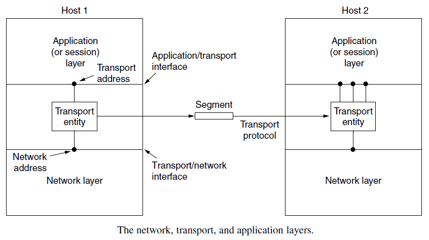

# 6.1.2 Transport Service Primitives

传输用户（应用程序）通过传输服务原语访问传输服务

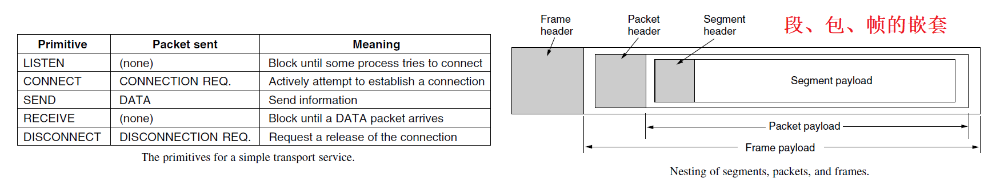

## 一个简单的建立和释放连接的状态图

* 拆除连接方式有两种

-不对称方式：任何一方都可以关闭双向连接；

-对称方式：连接的两个方向彼此独立,每个方向需单独关闭，双方都执行DISCONNECT才能关闭整条连接

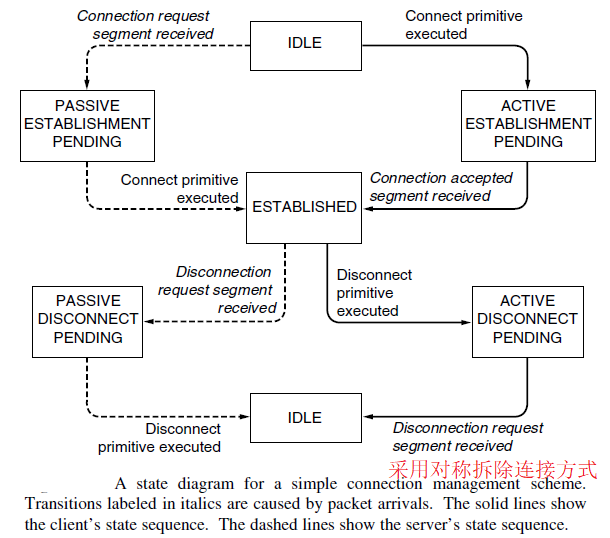

# 6.1.3 Berkeley Sockets套接字

TCP/IP中采用套接字原语,广泛应用于Internet程序设计中,尤其是基于Unix的系统和Windows系统中(Winsock)

## 套接字原语

* 建立连接

-服务器代码

* 调用socket创建一个新的套接字，并在传输层实体中分配表空间，返回一个文件描述符用于以后调用中使用该套接字；

* 调用bind将一个地址赋予该套接字，使得远程客户程序能访问该服务程序；

* 调用listen分配数据空间，以便存储多个用户的连接建立请求；

* 调用accept将服务程序阻塞起来，等待接收客户程序发来的连接请求。当传输层实体接收到建立连接的段时，新创建一个和原来的套接字相同属性的套接字并返回其文件描述符。服务程序创建一个子进程处理此次连接，然后继续等待发往原来套接字的连接请求。

* 建立连接

-客户程序

* 调用socket创建一个新的套接字，并在传输层实体中分配表空间，返回一个文件描述符用于在以后的调用中使用该套接字；

* 调用connect阻塞客户程序，传输层实体开始建立连接，当连接建立完成时，取消阻塞；

* 数据传输

-双方使用send和receive完成数据的全双工发送。

* 释放连接

-释放连接是对称的,双方都执行了close原语后连接被释放。

# 6.1.4 套接字编程实例：Internet文件传输

A client program requests a file from the server program, and the server responds by sending the whole file.

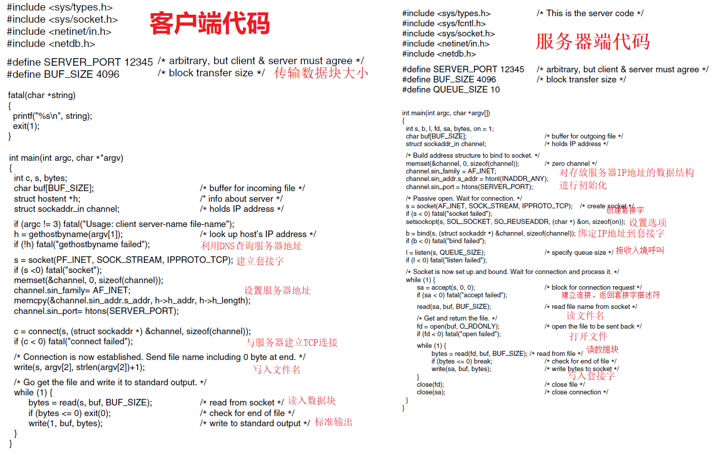

# 6.2 Elements of Transport Protocols

6.2.1 Addressing
6.2.2 Connection Establishment
6.2.3 Connection Release
6.2.4 Error Control and Flow Control
6.2.5 Multiplexing
6.2.6 Crash Recovery

## Transport Protocol

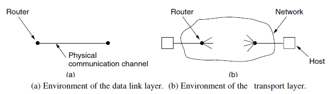

# 6.2.1 寻址（Addressing）

通常方法：定义端口，即传输服务访问点TSAP（Transport Service Access Point），来表示应用进程，用来与另一应用程序建立连接。
网络层的类似端点（网络层地址）亦称为网络服务访问点

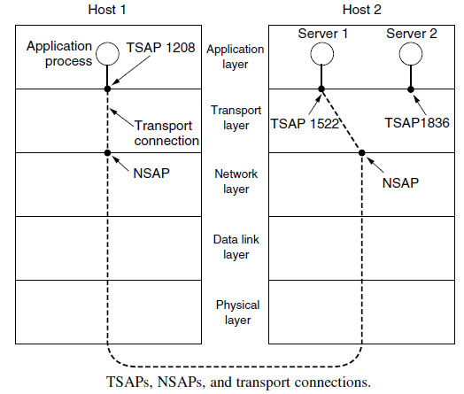

远方客户程序如何获得服务程序的TSAP？

–方法1：预先约定、广为人知的，如邮件服务器固定在TCP端口25；
–方法2：建立端口影射器。用户向端口影射器查询所需服务的TSAP，再与服务进程建立连接。注：新服务被创建时，其必须向端口影射器注册。
–方法3：初始连接协议。

* 一个称为进程服务器（process server）的进程(inetd)同时在多个端口上监听；

* 远方客户程序向它实际想访问的服务程序的TSAP发出连接建立请求；

* 如果没有服务程序在此TSAP上监听，则远方客户和进程服务器建立连接；

* 进程服务器派生出所请求的新的服务进程，并使该进程继承和远程客户的连接；

* 进程服务器返回继续监听新的连接请求；

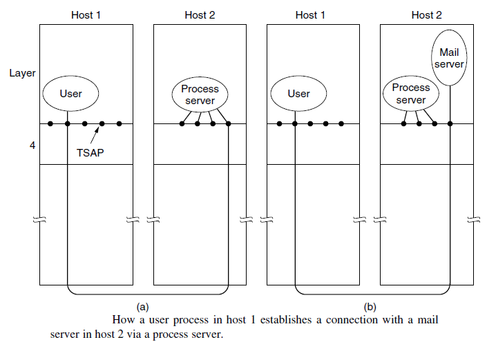

# 6.2.2建立连接

* 网络可能丢失、重复包，特别是延迟重复包的存在，导致传输层建立连接的复杂性（如重复建立连接）

* 解决延迟重复包的关键是丢弃过时的包

## 三次握手方案（three-way handshake）

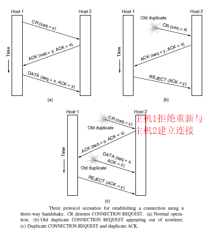

# 6.2.3释放连接

* 两种连接释放方法

–非对称式：一方释放连接，整个连接断开，存在丢失数据的危险；

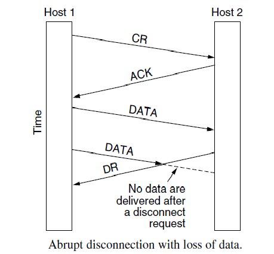

## 释放连接

–对称式：每个方向单独释放。即使主机发送了Disconnect段后仍可接收数据。

–由于两军问题的存在，可以证明不存在安全的通过N次握手实现对称式连接释放的方法；


## 著名的协议举例

* 占据东、西两个山顶的蓝军1和蓝军2与驻扎在山谷的白军作战。其力量对比是：单独的蓝军1或蓝军2打不过白军，但蓝军1和蓝军2协同作战则可战胜白军。现蓝军1拟于次日正午向白军发起攻击。于是用计算机发送电文给蓝军2。但通信线路很不好，电文出错或丢失的可能性较大（没有电话可使用）。因此要求收到电文的友军必须送回一个确认电文。但此确认电文也可能出错或丢失。试问能否设计出一种协议使得蓝军1和蓝军2能够实现协同作战因而一定（即100 %而不是99.999…%）取得胜利？


## 结论

* 这样无限循环下去，两边的蓝军都始终无法确定自己最后发出的电文对方是否已经收到。

* 没有一种协议能够蓝军能100% 获胜。

## 释放连接

–使用三次握手+ 定时器的方法释放连接在绝大多数情况下是成功的。

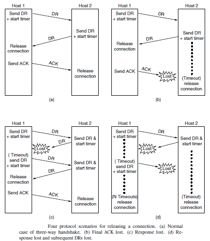

# 6.2.4 Error Control and Flow Control

* 传输层的校验和保护跨越各个网络路径的段，采用端到端的校验机制，与数据链路层校验不同。

* 传输层时间延迟较长，必须使用大的滑动窗口

* 缓存：由于网络层服务是不可靠的，传输层实体必须缓存所有连接发出的段，而且为每个连接单独做缓存，以便用于错误情况下的重传。

* 接收方的传输层实体既可以也可以不为特定的连接设置专用的特定缓存。如接收端可让设立一个缓冲池让所有连接共享。

* 如何组织缓冲池？见下页图

–组织成大小统一的缓冲区构成的池，每个缓冲区容纳一个段。
–使用可变大小的缓冲区
–为每个连接使用一个大的循环缓冲区。

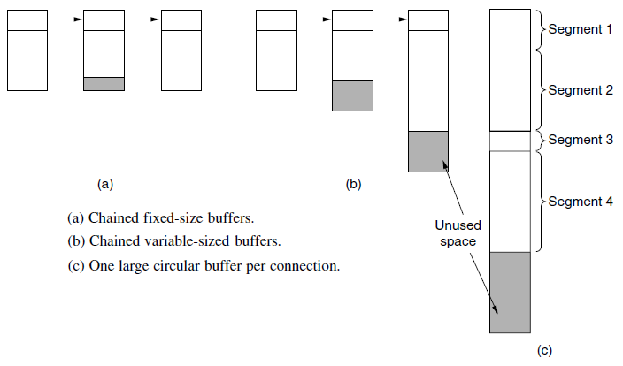

## 利用缓冲区控制发送端数据传输速率

* 初始时，发送端根据其需求请求缓冲区

* 接收端根据能力分配尽可能多的缓冲区

* 发送端每发送一段, 接收端减少其缓冲区数。到0时停止发送

* 接收端在逆向流量中稍带上确认和缓冲区数

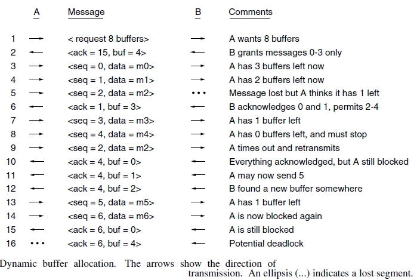

## 基于网络承载能力的流量控制机制

* 缓冲区空间不再限制最大流量时，网络的承载能力成为瓶颈

* 采用动态滑动窗口实现流量控制及拥塞控制

# 6.2.5多路复用

* 多路复用: 如多个传输层进程使用相同的网络地址

* 逆向多路复用:把传输层流量分摊到多条网络路径上

## Multiplexing

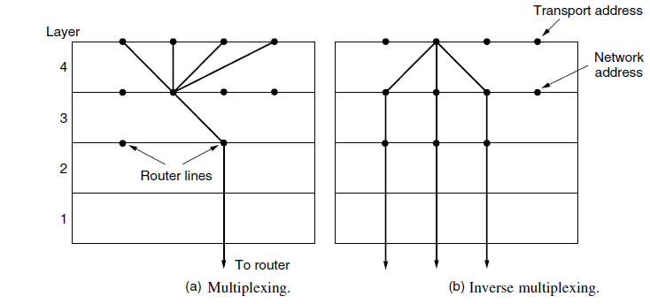

# 6.2.6Crash Recovery崩溃恢复

假设一主机向服务器发送文件，服务器有可能发生崩溃：

* 服务器可能发生3种事件：发送一确认（A）、将数据写到输出进程(W)、崩溃(C).

* 可能发生的6种顺序AC(W), AWC, C(AW), C(WA), WAC, and WC(A)

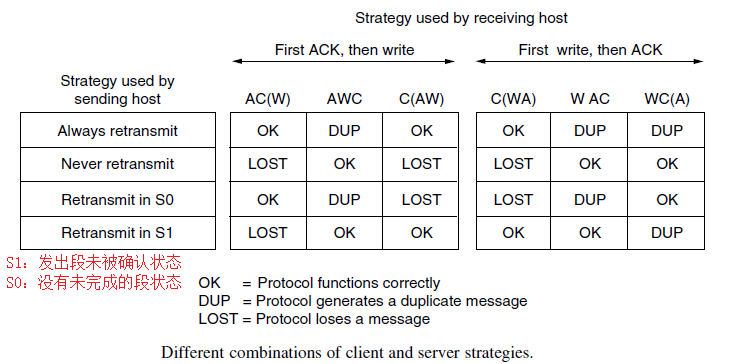

# 6.3 Congestion Control

6.3.1 Desirable Bandwidth Allocation
6.3.2 Regulating the Sending Rate
6.3.3 Wireless Issues

# 6.3.1 Desirable Bandwidth Allocation理想带宽分配

Efficiency and Power效率与功率:
实际吞吐量和延迟，在拥塞出现时性能开始下降。达到最大功率的负载表示了传输实体放置在网络上的有效负载

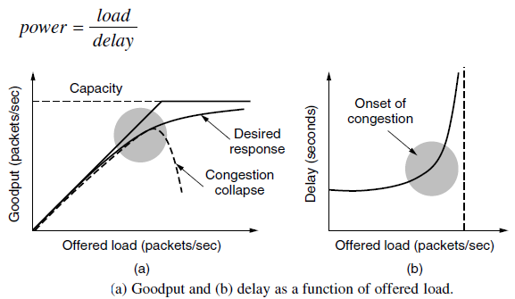

## 最大-最小公平性（Max-MinFairness）

如果分配给一个流的带宽在不减少分配给其他流带宽的前提下无法增加，则不给这个流更多带宽。即，增加一个流的带宽只会让不太富裕的那些流情况变得更糟。

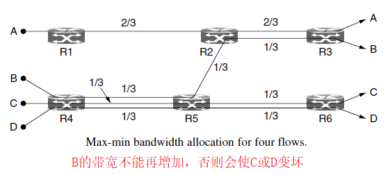

# 6.3.2 Regulating the Sending Rate

发送速率受到流量控制与拥塞控制的限制

## 拥塞控制协议中的信号

显式拥塞协议（XCP，eXplicit Congestion Protocol）：路由器通知源端速率
显式拥塞通知（ECN，Explicit Congestion Notification）：路由器在数据包中设置警告

## 速率控制法则

加法递增乘法递减(AIMD: Additive Increase Multiplicative
Decrease) 法则能达到有效、公平的操作点

# 6.3.3 Wireless Issues

问题：通常传输协议把丢包视作拥塞发生的信号，但在无线网络丢包几乎都是由传输错误引起的。
拥塞控制观察到的丢包应是由带宽不足造成的，如何办到？

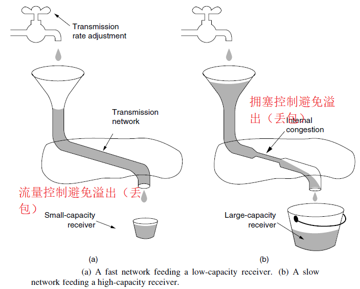

* 使用无线链路上的重传机制把无线网络的丢包掩盖起来

-链路层的帧重传与传输层的拥塞控制作用在不同尺度上

* 其他方案：如前向纠错FEC

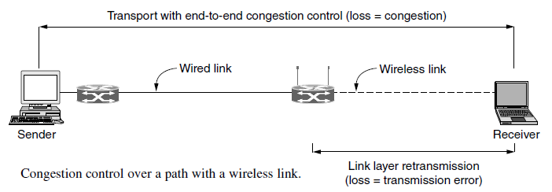

# 6.4 The Internet Transport Protocols: UDP

6.4.1 Introduction to UDP
6.4.2 Remote Procedure Call
6.4.3 Real-Time Transport Protocols

# 6.4.1 Introduction to UDP

UDP ：用户数据报协议

*  无连接的传输协议

*  没有流量控制、无拥塞控制、无重传机制

# 6.4.2 Remote Procedure Call 远程过程调用


# 6.4.3 Real-time Transport Protocols（RTP）实时传输协议

* 实时多媒体应用

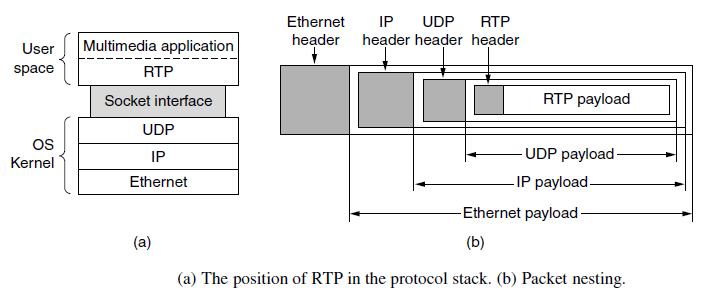

## RTP头格式

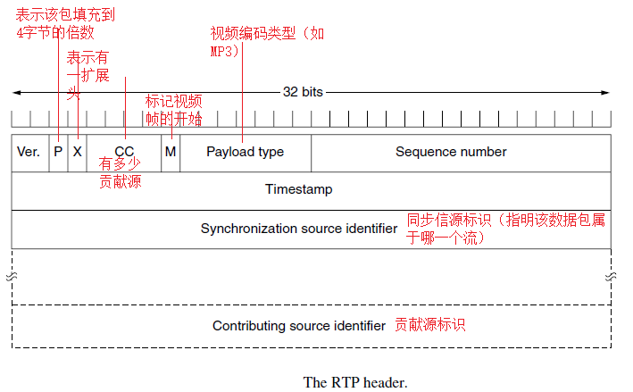

## RTCP实时传输控制协议

能处理反馈、同步、用户接口等信息

* 可以向源端提供延迟、抖动、带宽、拥塞等网络特性的反馈信息

* 处理流之间的同步

* 提供了命名不同源的方法，如可告诉用户在和谁说话

## 带有缓冲和抖动控制的播放

* 在接收端媒体播放之前进行缓冲，以减少抖动

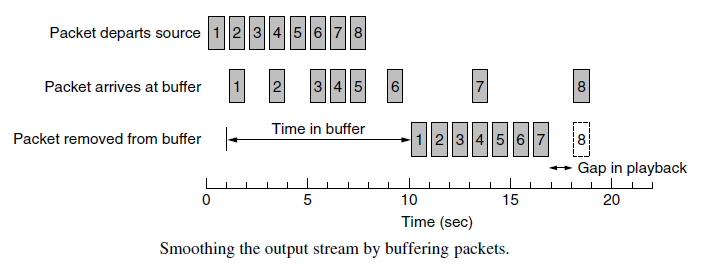

## 带有缓冲和抖动控制的播放

* 播放点的设置：决定等待多长时间取决于抖动


# 6.5 The Internet Transport Protocols: TCP

6.5.1 Introduction to TCP
6.5.2 The TCP Service Model
6.5.3 The TCP Protocol
6.5.4 The TCP Segment Header
6.5.5 TCP Connection Establishment
6.5.6 TCP Connection Release
6.5.7 TCP Connection Management Modeling
6.5.8 TCP Sliding Window
6.5.9 TCP Timer Management
6.5.10 TCP Congestion Control

# 6.5.1 Introduction to TCP

传输控制协议TCP（Transmission Control Protocol）

-面向连接的、可靠的、端到端的、基于字节流的传输协议

用户数据协议UDP（User Data Protocol）

-无连接的端到端传输协议

The IP layer gives no guarantee that datagrams will be delivered properly, nor any indication of how fast datagrams may be sent. It is up to TCP

* to send datagrams fast enough to make use of the capacity but not cause congestion

* to time out and retransmit any datagrams that are not delivered.

* to reassemble datagrams in the wrong order into messages in the proper sequence.

In short, TCP must furnish good performance with the reliability that most applications want and that IP does not provide.

# 6.5.2 The TCP Service Model

* 应用程序访问TCP服务是通过在收发双方创建套接字来实现的；

* 套接字的地址是用（IP地址，主机端口号）来表示的。1024以下的端口号被特权用户保留，如FTP/21，HTTP/80；

* 每条连接用(套接字1,套接字2)来表示，是点到点的全双工通道；

* TCP不支持多播（multicast）和广播（broadcast）；

* TCP连接是基于字节流的，而非消息流。

* 对于应用程序发来的数据，TCP可以立即发送，也可以缓存一段时间以便一次发送更多的数据。为了强迫数据发送，可以使用PUSH标记；

* 对于紧急数据（urgent data），可以使用URGENT标记。

## The TCP Service Model

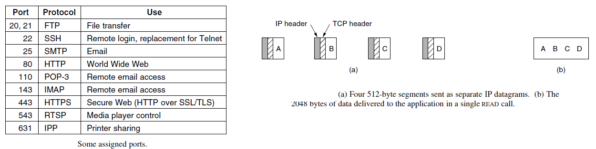

# 6.5.3 The TCP Protocol

* 每个段有一个32位的序号；

* 传输实体之间使用段(segment)交换数据；

* 每个段包含一个20字节的头（选项部分另加）和0个或多个数据字节。段的大小必须首先满足65535字节的IP包数据净荷长度限制，还要满足底层网络传输介质的最大传输单元（MTU）的限制，比如以太网的MTU为1500字节；

* TCP实体使用滑动窗口协议，确认序号等于接收方希望接收的下一个序号。

# 6.5.4 The TCP Segment Header

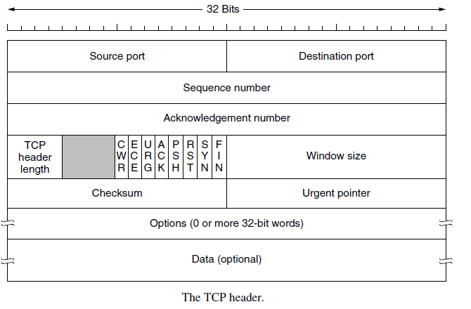

## The TCP Segment Header

* 源端口和目的端口：各16位；

* 序号和确认号：以字节为单位编号，各32位；

* TCP头的长度：指明了TCP头包含多少个32位的字，包含可选项域；

* 4位的保留域；

* 8个1比特的标识位：置1表示有效

```
-ECE：给TCP发送端发信号，告诉发送端放慢发送速度
-CWR：发送端给接收端发信号表明发送端已放慢速率
-URG：和紧急指针配合使用，发送紧急数据；
-ACK：表示确认号字段是否有效；
-PSH：指示发送方和接收方将数据不做缓存，立刻发送或接收；
-RST：由于不可恢复的错误重置连接；
-SYN：用于连接建立指示；
-FIN：用于连接释放指示
```

* 窗口大小：用于基于可变滑动窗口的流控，指示发送方从确认号开始可以再发送窗口大小的字节流；

* 校验和：为增加可靠性，对TCP头，数据和伪头计算校验和；

* 可选项域, 如指定愿意接收的最大段长、时间戳等

# 6.5.5 TCP Connection Establishment

## TCP连接管理

* 三次握手建立连接

-服务器方执行LISTEN和ACCEPT原语，被动监听；
-客户方执行connect原语，产生一个SYN为1和ACK为0的TCP段，表示连接请求；
-服务器方的传输实体接收到这个TCP段后，首先检查是否有服务进程在所请求的端口上监听，若没有，回答RST置位的TCP段；
-若有服务进程在所请求的端口上监听，该服务进程可以决定是否接受该请求。在接受后，发出一个SYN置1和ACK置1的TCP段表示连接确认，并请求与对方的连接；
-发起方收到确认后，发出一个SYN置0和ACK置1的TCP段表示给对方的连接确认；
-若两个主机同时试图建立彼此间的连接，则只能建立一条连接。

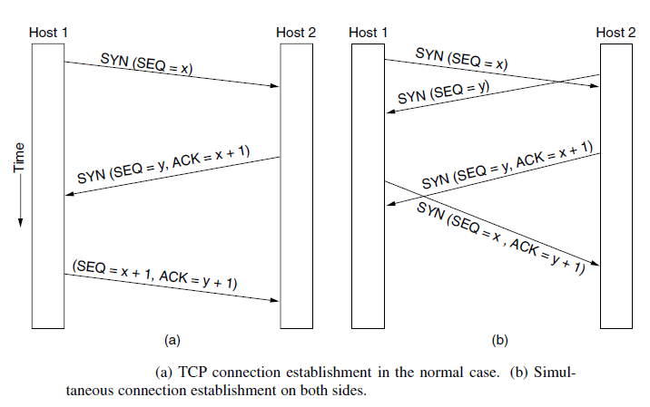

# 6.5.6 TCP Connection Release

## 单向的连接释放

释放连接时，发出FIN位置1的TCP段并启动定时器，在收到确认后关闭连接。若无确认并且超时，也关闭连接。

# 6.5.7 TCP Connection Management Modeling

TCP连接管理的有限状态机

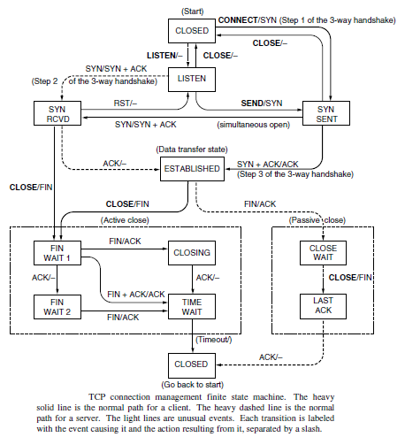

# 6.5.8 TCP Sliding Window

## TCP的窗口管理机制
-基于确认和可变窗口大小；
-窗口大小为0时，正常情况下，发送方不能再发TCP段，但有两个例外

* 紧急数据可以发送；
* 为防止死锁，发送方可以发送1字节的TCP段，以便让接收方重新声明确认号和窗口大小。

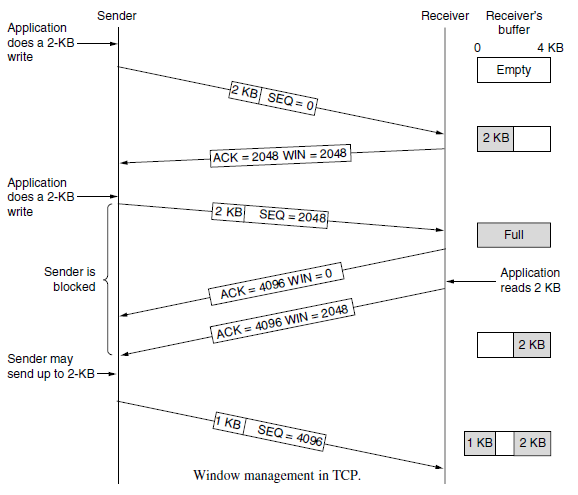

## 如何改进传输层的性能？

-策略1：发送方缓存应用程序的数据，等到形成一个比较大的段再发出；

-策略2：在没有可能进行“捎带”的情况下，接收方延迟发送确认段；

-策略3(Nagle算法解决小数据包问题)：当应用程序每次向传输实体发出一个字节时，传输实体发出第一个字节并缓存所有其后的字节直至收到对第一个字节的确认；然后将已缓存的所有字节组段发出并对再收到的字节缓存，直至收到下一个确认；

-策略4：使用Clark算法解决低能窗口综合症（silly window syndrome）

* 傻窗口症状：当应用程序一次从传输层实体读出一个字节时，传输层实体会产生一个一字节的窗口更新段，使得发送方只能发送一个字节

* 解决办法：强制接收端必须等待一段时间，直到有了一定数量的可用空间后再通告给对方。

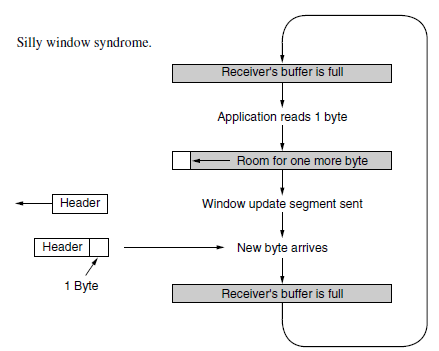

# 6.5.9 TCP Timer Management

重传计时器的值如何设置？

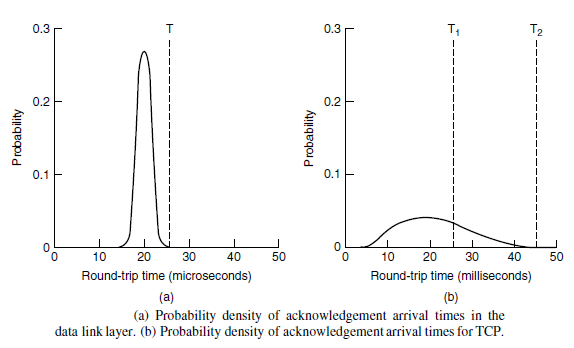

# 6.5.10 TCP Congestion Control

## TCP处理网络拥塞的措施

* 发送方维护两个窗口：流量控制窗口和拥塞窗口，按两个窗口的最小值发送；

* 拥塞窗口是任何时候发送端可以往网络发送的字节数

* 流量控制窗口指出了接收端可以缓冲的字节数

## 利用突发数据包返回发送端的速率得到最慢链路的速率

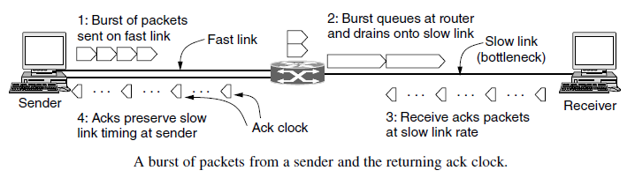

## TCP的拥塞控制

慢速启动: 
在网络拥塞窗口启动时，按指数规律增长。发送一个报文段，收到一个确认，窗口大小变为2个报文段；发送两个报文段，收到两个确认，将窗口大小增大到4个报文段；以此类推，直到窗口大小达到阈值（慢启动阈值）。

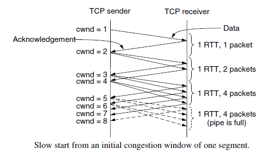

## TCP Tahoe

* 每当检测到丢包（如确认时钟超时），慢启动阈值就被设置为当前拥塞窗口的一半

* TCP从慢速启动切换到线性增加

* 利用重复确认识别数据包丢失。

* 数据包丢失后启动快速重传：慢启动阈值被设置为当前拥塞窗口的一半，重新开始慢启动过程。

## TCP Reno

* 快速恢复（fastrecovery），阈值减半

* 加法递增（RTT）+乘法递减（RTT）
